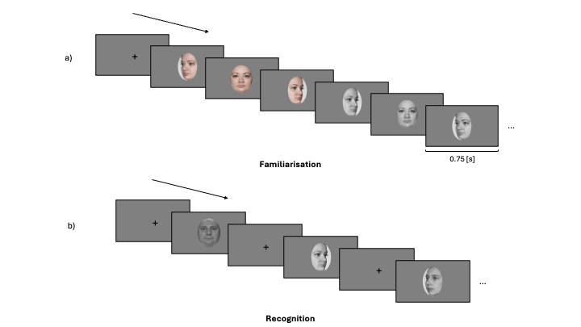
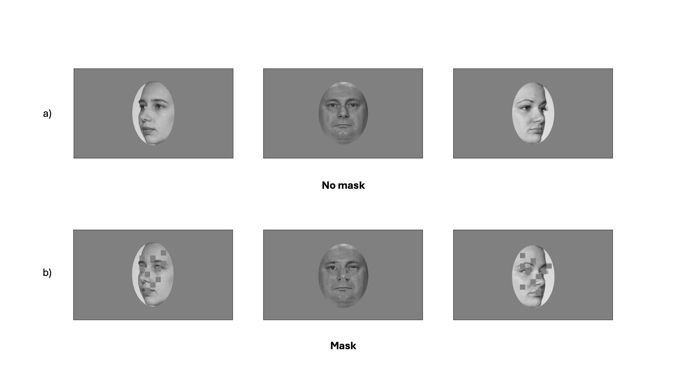

```{r load-pkg}
#| include: false
pkg <- c("tidyverse", "RColorBrewer", "patchwork", "gtsummary", "paletteer","readxl", "eeptools", "here", "gridExtra", "EMC2", "tidybayes")

lapply(pkg, library, character.only = TRUE)
```

```{r}
#| label: setup
#| include: false

library(tidyverse)
library(gt)
library(tinytable)

knitr::opts_chunk$set(echo = FALSE)

theme_set(
  theme_bw() +
    theme(text = element_text(size = 15, face = "bold"), 
          title = element_text(size = 15, face = "bold"),
          legend.position = "right")
)
## plot settings ##
## Plot colors
myColors_1 <- c("Novel" = paletteer_d("rcartocolor::Safe",4)[1],"Learned" =  paletteer_d("rcartocolor::Safe",4)[2])
myColors_2 <- c("Novel" = paletteer_d("rcartocolor::Safe",4)[1],"Famous" =  paletteer_d("rcartocolor::Safe",4)[3])
## Set the amount of dodge in figures
pd <- position_dodge(0.7)
pd2 <- position_dodge(1)

#Color drift rate
myColors_drift <- RColorBrewer::brewer.pal(12, "Dark2")[4:5]
colScale_drift <- scale_fill_manual(name = "Accuracy", values = myColors_drift)

```



# Introduction

The ability to quickly and accurately recognise a familiar face is an important aspect of everyday life, as it guides social behaviour. The way that one might interact with a family member or friend is different to a stranger. Moreover, for familiar individuals, we not only know what they look like, but we also have access to person knowledge, such as their traits, attitudes, name and professional status. The same is true for famous individuals, such as movie stars, professional athletes and politicians. To date, most prior face recognition research has used manifest (observed) measures (i.e., response times and accuracy) to assess one's ability to recognise faces. As such, less is known about the latent computational processes that support face recognition [@phillipsStateModellingFace2025]. In the current project, we investigated how different types of familiarity, including visual feature familiarity and stored person knowledge, affected the latent processes that can be estimated by evidence accumulation models (EAMs; @ratcliffModelingResponseTimes1998). This computational approach has provided new insights on the dynamics of the decision process supporting face recognition.

Face recognition processes have been intensely investigated over the last 50 years [@johnstonFamiliarUnfamiliarFace2009; @natuNeuralProcessingFamiliar2011]. One influential cognitive model of face recognition proposed a division between structural encoding of facial features, and more elaborate processes associated with identity recognition and person information [@bruceUnderstandingFaceRecognition1986]. Subsequent neuroscience research in humans and monkeys has enriched this model by relating different cognitive processes to different brain circuits [@landiFastLinkFace2021 @gobbiniNeuralResponseVisual2006; @gobbiniNeuralSystemsRecognition2007; @haxbyDistributedHumanNeural2000; @duchaineRevisedNeuralFramework2015]. The resulting model is a distributed neural network that incorporates two distinct systems: a core system and an extended system. The core system is dedicated to structural coding of facial features and spans fusiform gryi, as well as occipital and posterior temporal cortices. In contrast, the extended system is involved in more elaborate processes, such as those related to person knowledge, and is mediated by a broader network of brains areas spanning anterior temporal and frontal cortices [@duchaineRevisedNeuralFramework2015; @gobbiniNeuralSystemsRecognition2007; @haxbyDistributedHumanNeural2000; @ishaiLetsFaceIt2008; @kanwisher111FunctionalArchitecture2011]. By mediating the retrieval of identity-specific information from memory, the extended system is able to support the recognition of faces for which prior person knowledge information has been stored [@idagobbiniSocialEmotionalAttachment2004; @leibenluftMothersNeuralActivation2004].

Given the importance of knowing who it is you are interacting with, the study of familiarity has been a key aspect of the face perception research [@youngAreWeFace2018]. Largely using manifest measures, such as reaction time and accuracy, research consistently shows that familiar faces, especially those imbued with person knowledge, facilitate a range of face recognition processes compared to previously unseen individuals or visually familiar faces [@ramonFamiliarityMattersReview2018; @youngAreWeFace2018]. It has been argued that person knowledge involves a qualitatively different and deeper level of processing than visual familiarity [@schwartzIndependentContributionPerceptual2019], which facilitates the accurate discrimination of familiar from unfamiliar faces [@akanHaventSeenYou2023; @schwartzRolesPerceptualConceptual2016; @akanHaventSeenYou2023; @birdEffectsPreexperimentalKnowledge2011; @klatzkyRecognizingFamiliarUnfamiliar1984; @schwaningerRoleFeaturalConfigural2002].

Although manifest (observed) measures of performance have formed the bedrock of research findings on face perception, there have been many calls in recent years to embrace more computational approaches in social and cognitive neuroscience research [@charpentierApplicationComputationalModels2018; @forstmannIntroductionModelBasedCognitive2024a; @hackelComputationalNeuroscienceApproaches2018; @lockwoodComputationalModellingSocial2021; @parker2024; @phillipsStateModellingFace2025] (Cheong et al., 2017). The first benefit of adopting computational approaches is that relationships between parts of a system can be more explicitly specified [@yarkoniGeneralizabilityCrisis2022] (Hintzman, 1991), which aids the development of theory [@muthukrishnaProblemTheory2019; @oberauerAddressingTheoryCrisis2019; @proulxStatisticalRitualTheory2021]. On the other hand, latent (unobserved) parameters can be estimated, which can give rise to different interpretations of the cognitive processes involved in task performance [@ratcliffEffectsAgingReaction2001]. Moreover, there is currently almost no understanding of the computational processes that support face recognition processes when familiarity is based on visual exposure compared to stored person knowledge [@phillipsStateModellingFace2025].

Evidence accumulation models (EAM) are one approach to investigate the computational processes that are involved in speeded decision tasks (for a review, see @ratcliffDiffusionDecisionModel2016). While a variety of different evidence accumulation models exists, they all share a similar set of assumptions: that evidence for each response option accumulates at different rates until one response option crosses a threshold and a response is triggered (see @fig-LBA for an example of the linear ballistic accumulator (LBA) model; @brownSimplestCompleteModel2008). These models work by translating the distribution of response times for correct and incorrect responses into estimates of latent variables assumed to underlie the decision-making process [@tbl-lba; @brownSimplestCompleteModel2008; @donkinDrawingConclusionsChoice2011]. These latent variables can then be mapped onto psychological constructs [@myersPracticalIntroductionUsing2022]. For example, drift rate is the rate at which evidence in favor of a decision accumulates over time, reflecting the signal-to-noise ratio provided by the stimulus. Threshold represents the amount of accumulated evidence needed to trigger the decision, reflecting the response caution towards a specific response. The starting point is the amount of evidence towards a response before the accumulation of evidence begins, reflecting the *a priori* bias towards a response. Finally, the non-decision time is an estimation of the time taken to complete processes that are not involved in the decision time, such as stimulus encoding and motor responses.

:::: {.place arguments="bottom, scope: \"parent\", float: true"}
:::{#fig-LBA fig-cap = "Schematic of the linear ballistic accumulator (LBA) model"}
{width="90%"}
:::
*This diagram represents the accumulation process one trial of a perceptual decision task for the linear ballistic accumulator (LBA). Participants are required to chose between two options (Response 1 and Response 2). In a LBA model, there is a separated accumulation of evidence (v) for each response option. In this example, the correct response is Response 1. The accumulator on the left is the accumulator for the correct response (Response 1), and the green line in represents the rate at which the evidence accumulates in favor of that response option. The accumulator on the right is the accumulator for the incorrect response (Response 2), and the dash red line represents the rate at which the evidence accumulates in favor of this response option. Once the accumulated evidence crosses the threshold (b) of a response option, the corresponding response is chosen (in this case Response 1).* 
::::

```{r}
#| label: lba-params
#| include: false

# Helper function to handle format-dependent subscripts
format_subscript <- function(text) {
  if (knitr::is_html_output()) {
    # For HTML output, use HTML tags
    return(text)
  } else {
    # For Typst/PDF output, replace HTML tags with Typst's sub[] function
    text <- gsub("<sub>(.*?)</sub>", "#sub[\\1]", text)
    return(text)
  }
}

# create a df
lba_params <- tribble(
  ~Parameter, ~Label, ~Construct,
  "Start point", "A", "response bias",
  "Drift rate", "v", "signal-to-noise ratio",
  "Threshold", "b", "response caution",
  "Non-decision time", format_subscript("t<sub>0</sub>"), "stimulus encoding and motor response"
)
```

```{r}
#| label: tbl-lba
#| tbl-cap: Parameters in the linear ballistic accumulator model

lba_params |> 
  tt()
```

In the present study, we used evidence accumulation modelling to ask new and different questions regarding the computational processes that support the recognition of familiar versus unfamiliar individuals. More specifically, we address how different types of familiarity (visual feature familiarity versus visual feature familiarity plus person knowledge) impact response caution and signal-to-noise ratio. Based on prior work in experimental psychology [@parker2024; @ratcliffDiffusionDecisionModel2016], we chose to primarily focus on drift rate and response caution as our primary parameters of interest because we could easily and intuitively see how performance advantages could emerge based on familiarity. For instance, based on conventional use of EAMs [@myersPracticalIntroductionUsing2022], increases in signal-to-noise ratio and/or reductions in response caution could be interpreted as the task setting becoming easier.

We, therefore, hypothesised that either drift rate and/or threshold would be affected by the face familiarity manipulation. However, given the general lack of prior evidence accumulation modelling in face recognition research, we were unsure *a priori* of the direction of the effects. For instance, we considered it plausible that novel compared to familiar stimuli could provide a benefit in some instances, by virtue of a pop-out or novelty detector [@glanzerMirrorEffectRecognition1985; @kormi-nouriNoveltyEffectSupport2005; @schomakerNoveltyEnhancesVisual2012; @tulvingNoveltyAssessmentBrain1995]. Likewise, we also considered it plausible that familiar compared to novel stimuli could providing a benefit based on the many advantages reported for recognising personally familiar or famous individuals [@ramonFamiliarityMattersReview2018; @youngAreWeFace2018]. Nonetheless, across a series of experiments, we used manipulations of familiarity that either only targeted the operation of core system only or the core and extended system of face perception (@tbl-exp), so that we could further understand the computational processes that underpin different types of familiar face recognition.

```{r}
#| label: exp-details
#| include: false

# create a df
exp_details <- tribble(
  ~Exp, ~Setting, ~'Familiarity type', ~'Face comparision', ~'Face system',
  "1", "laboratory", "visual", "visual exposure vs unknown", "core",
  "2", "online", "visual", "visual exposure vs unknown", "core",
  "3", "laboratory", "visual & person knowledge", "famous vs unknown", "core & extended",
  "4", "online", "visual & person knowledge", "famous vs unknown", "core & extended",
)
```

```{r}
#| label: tbl-exp
#| tbl-cap: An overview of the experimental work

exp_details |> 
  tt()
```

# Method and Materials

We report how we determined our sample size, all data exclusions (if any), all manipulations, and all measures in the four experiments [@simonsConstraintsGeneralityCOG2017].

## Experiment 1

### Pre-registration and open science

The research question, hypotheses, experimental design, planned analysis, and exclusion criteria were preregistered. The preregistration, raw data, stimuli, data wrangling and analysis code as well as the evidence-accumulation models outputs are available on the Open Science Framework (<https://osf.io/azyvu/overview>).

```{r}
#| label: load-demo-exp1
#| include: false

demo_exp1 <- read_xlsx(here("Exp_1", "data", "Master_list_WP1_1.xlsx")) %>%
    mutate(Index = as.factor(Index),
         Gender = as.factor(Gender),
         Date_of_birth = as.Date(Date_of_birth),
         Age = floor(age_calc(Date_of_birth, units = "years")))
mean_age_exp1 = round(mean(demo_exp1$Age), digits = 2)
sd_age_exp1 = round(sd(demo_exp1$Age), digits = 2)
female_exp1 = sum(demo_exp1$Gender== "F")
male_exp1 = sum(demo_exp1$Gender== "M")
participant_n_exp1 = female_exp1 + male_exp1
min_age_exp1 = min(demo_exp1$Age)
max_age_exp1 = max(demo_exp1$Age)
```

### Participants

All participants were recruited using either an online recruiting platform (<https://marktplatz.uzhalumni.ch>) or via a mailing list dedicated to students from the Department of Psychology of the University of Zurich. Sample size was determined in advance. Following previous suggestions from @heathcoteDynamicModelsChoice2019, a parameter recovery study was run to estimate if 30 usable participant datasets were sufficient to accurately recover the parameter estimates. The parameter recovery study included 30 participant datasets, each with 180 trials (90 trials "familiar" and 90 trials "unfamiliar") and with our selected model parameterisation. The data-generated parameters were sufficiently well-recovered (See Supplementary Materials). `r participant_n_exp1` healthy participants took part in Experiment 1 (`r male_exp1` men and `r female_exp1` women). Ages ranged from `r min_age_exp1` to `r max_age_exp1` years old ($M_{age} =$ `r mean_age_exp1`, $SD_{age} =$ `r sd_age_exp1`). All participants reported normal or corrected-to-normal vision and received payment (20 CHF) for participating in the experiment. Based on our preregistration, response times longer than 2.5 seconds were removed from the analysis. However, this cutoff value led to the the removal of 59% of the trials of one participant. Given the recommendation of having a certain number of trials per condition per participant when using evidence-accumulation models [@heathcoteDynamicModelsChoice2019; @parker2024], this participant was excluded from the data analysis. This experiment was accepted by the ethics committee of the Federal Institute of Technology Zurich (ETHZ), and all participant gave their informed consent to participate in the study.

### Stimuli

The stimuli consisted of images selected from two different data sets of face images: the Face Research Lab London Set (DeBruine, Lisa; Jones, Benedict (2017). Face Research Lab London Set. figshare. Data set. <https://doi.org/10.6084/m9.figshare.5047666.v5>) and the Color FERET Database (<https://www.nist.gov/itl/products-and-services/color-feret-database>). Each of these data sets is composed of images of different identities faces taken from different angle points. 102 identities were selected from the Face Research Lab London Set and 51 from the Color FERET Database. For each selected identity, three pictures of the face at three different view points (3/4 left view, frontal view and 3/4 right view) were cropped to only keep the internal features of the face. All of the images processing was realized using the free community-developed software GNU Image Manipulation Program (@GIMP). After 4 pilots experiments, we removed 27 identities (21 from the Face Research Lab London Set and 6 from the Color FERET Database) due to to the presence of identifiable features (i.e. skin marks, make-up...). In total, the data set of face images used in Experiment 1 contained 756 images: one set of three colorful face images and one set of three gray scaled face images for each of the 126 identities.

### Material

Stimuli were presented on the screen of a MacBook Pro (Apple M2 Pro, macOS 13 Ventura). The experiment was run on Psychopy Coder (version: 2022.5, @peircePsychoPy2ExperimentsBehavior2019) and the code used for the experimental procedure is available on OSF (<https://osf.io/azyvu/overview>).

### Procedure

The experimental task was divided into two distinct parts: a familiarization part and a recognition part (@fig-proc-exp1). In the familiarization part, the face of 30 unknown identities were presented on the screen and participants were told to memorize the identity of the faces. One familiarization trial consisted of the presentation of 6 face images, one after the other, depicting the same identity but varying in viewing points (3/4 left view, frontal view and 3/4 right view) and the colorimetry (colorful image, gray scale image). The duration of each image presentation was 0.75 second. Each participant underwent 30 familiarization trials. During the familiarization, we introduced catch trials to ensure participants attention. After some familiarization trials, a gray scale image of a person's face was presented on the screen. Participants were asked to press the "q" key if the face belonged to the last seen identity or the "p" key if it was not. The faces seen during the familiarization were considered the "Learned faces" within-subject condition.

In the recognition part, participants completed three blocks of 90 recognition trials. Each block was separated from another by a short break. Half of the trials were learned identities trials and the other half were new, previously unseen identities trials. In each trial, a gray scale image of a face was shown on the screen. Participants were asked to choose if they had previously seen this face in the familiarization part or not. If they did, the should press the "q" key and if they did not, the "p" key. Participants were asked to respond as quickly and accurately as possible. It is important to note that participants never saw two pictures of the same learned identity in the same block and never saw the same picture (3/4 left view, frontal view, or 3/4 right view) of a learned identity during the entire recognition part. Furthermore, each novel identity was only presented once in the entire recognition part. Response time \[s\] and accuracy were collected after each recognition trial.

:::: {.place arguments="bottom, scope: \"parent\", float: true"}
:::{#fig-proc-exp1 fig-cap = "Experimental procedure of Experiment 1"}

:::

*The experimental procedure was divided into two parts: a familiarization part and a recognition part. a) In the familiarization part, participants were asked to memorize the face identity of 30 identities. For each identity, participants looked at 6 pictures depicting the same identity with different face orientation (3/4 left view, frontal view and 3/4 right view) and different colorimetry (color and gray scale images) in the order presented here: 3/4 left view, frontal view and 3/4 right view in color, followed by 3/4 right view, frontal view and 3/4 left view in gray scale. b) In each trial of the recognition part, participants had to decided if they recognize the face shown on the screen from the familiarization part. If they did, they had to press the "q" key and if the did not, the "p" key. They completed three blocks of 60 trials (half of them were from the familiarization part, half were novel faces). For the recognition part, only gray scale images of faces were used (for both learned faces and novel faces).* 
::::

## Experiment 2

### Pre-registration and open science

The research question, hypotheses, experimental design, planned analysis, and exclusion criteria were preregistered. The preregistration, raw data, stimuli, data wrangling and analysis code as well as the evidence-accumulation models outputs are available on OSF (<https://osf.io/tu2eh/overview>).

```{r}
#| label: age-gender-exp2
#| include: false

demo_exp2 <- read_csv(here("Exp_2", "data", "data_exp_2", "prolific_demographic_exp2.csv")) %>%
    mutate(`Participant id` = as.factor(`Participant id`),
         Sex = as.factor(Sex), 
         Age = as.numeric(Age))
total_number_part <- length(demo_exp2$`Participant id`)
inform_consent <- length(demo_exp2$`Participant id`[demo_exp2$Status=="RETURNED"])
demo_exp2_completed <- demo_exp2 %>%
  filter(!Status == "RETURNED")
number_part_compl <- length(demo_exp2_completed$`Participant id`)

mean_age_exp2 = round(mean(demo_exp2_completed$Age), digits = 2)
sd_age_exp2 = round(sd(demo_exp2_completed$Age), digits = 2)
female_exp2 = sum(demo_exp2_completed$Sex== "Female")
male_exp2 = sum(demo_exp2_completed$Sex== "Male")
participant_n_exp2 = female_exp1 + male_exp1
min_age_exp2 = min(demo_exp2_completed$Age)
max_age_exp2 = max(demo_exp2_completed$Age)
```

```{r}
#| label: exclusion-exp2
#| include: false

data_wrangle_exp_2 <- read_csv(here("Exp_2", "data", "data_exp_2", "wrangle_data_exp_2.csv")) %>%
  mutate(rt_OSF = if_else(
         rt < 2.0 | rt < 0.2, "yes", "no"))

#RT check
rt_check <- data_wrangle_exp_2 %>%
  group_by(pid) %>%
  summarise(sum_rt = sum(is.na(rt_OSF)),
            perc = sum_rt*100/180)
part_trial_25<-length(rt_check$pid[rt_check$perc>25])
part_trial_25_pid <- rt_check$pid[rt_check$perc>25]

#Acc check 
acc_check <- data_wrangle_exp_2 %>%
  filter(!is.na(rt_OSF),
         !pid %in% part_trial_25_pid) %>%
  select(!rt_OSF)

acc_check <- acc_check %>%
  group_by(pid) %>% 
  summarise(sum = sum(acc),
            n = n(), # n here is the total trials per grouping
            perc = sum/n*100)
part_acc_55 <- length(acc_check$pid[acc_check$perc < 55])
part_acc_55_pid <- acc_check$pid[acc_check$perc < 55]

#Participants for data analysis
participant_analysis_2 <- data_wrangle_exp_2 %>%
  filter(!pid %in% part_trial_25_pid,
         !pid %in% part_acc_55_pid)
number_participant_analysis_2 <- length(unique(participant_analysis_2$pid))
```

### Participants

All participant were recruited on the Prolific platform (<https://www.prolific.com>). Regarding the participants recruitment criteria established, participants had to be located in the United Kingdom or in the United States. Participants must be between 18-65 years old, with normal or corrected-to-normal vision. They must fluently speak English. Furthermore, Prolific offers the option to chose the approval rate of the participants willing to take part in the study. The approval rate is the percentage for which participants has been approved in previous experiment. A approval rate between 95% and 100% was established in our study to ensure data quality. Following Prolific payment principles, each participant received 9 pound for the completion of the study. This experiment was accepted by the ethics committee of the Federal Institute of Technology (ETH) Zurich.

`r total_number_part` participants started the experiment. After reading the inform consent, `r inform_consent` participants decided to not continue the experimental procedure and withdraw from the experiment. In the end, `r number_part_compl` participants completed the experiment (`r male_exp2` men and `r female_exp2` women) and gave their informed consent. Ages ranges from `r min_age_exp2` to `r max_age_exp2` ($M_{age} =$ `r mean_age_exp2`, $SD_{age} =$ `r sd_age_exp2`). Following our preregistration exclusion criterion, `r part_trial_25` participants were excluded because their percentage of missed trials was higher lower than 25% and `r part_acc_55` was removed because the overall accuracy was lower than 55%. In the end, the data of `r number_participant_analysis_2` participants was retained for the analysis and the LBA modeling.

### Stimuli

In an attempt to replicate the findings of Experiment 1, the stimuli used in this experiment were exactly the same as the ones used in Experiment 1 (See Method and Materials, Experiment 1, Stimuli).

### Material

Given the online nature of this experiment, participants were asked to complete the study using a desktop computer. The experimental procedure has been tested on three different operative systems (PC, Macintosh and Linux), as well as on three different web browsers (Google Chrome, Safari and Firefox). Participants were asked to specifically used these operative systems and these web browsers to ensure a good procedure. We received no complain from participants in regards to an inability to run the experiment on their own device because of technical issues.

### Procedure

On Prolific, participants who wished to take part in the experiment read the study information and selected an URL link to the Pavlovia (Open Science Tools, Nottingham, UK) platform. After selecting the URL link, a Pavlovia webpage opened to the inform consent of the study. Participants chose if they wanted to complete this study or not after reading the inform consent. The access to the task was only granted if participants accepted the terms of the inform consent. (**Should I add in the supplementary material how the inform consent was displayed to the participant and was was written in it?**)

```{r}
#| label: rt-2-exp1
#| include: false
rt_exp_1 <- read_csv(here("Exp_1","data", "raw_data_exp_1.csv"))
rt_exp_1_2 <- rt_exp_1 %>%
  filter(!pid == "1",
         rt > 2)
number_rt_1 <- nrow(rt_exp_1_2)
perc_rt_1 <- round((number_rt_1 / nrow(rt_exp_1)) *100, 3)
```

Regarding the experimental procedure, it was almost identical to the one used in Experiment 1 (Method and Materials, Experiment 1, Procedure). A response time window was added in the recognition part of the experiment. Instead of removing trials with a response time higher than 2.5 seconds after data collection, we decided to implement a response time window of 2 seconds for each recognition trial. In Experiment 1, `r perc_rt_1`% of the trials were longer than 2 seconds. We expected participants to quickly get accustomed to the response time limit and that the average percentage of missed trials will be similar or lower than in Experiment 1. Response time \[s\] and accuracy were collected after each recognition trial.

## Experiment 3: Famous faces

### Pre-registration and open science

The research question, hypotheses, experimental design, planned analysis, and exclusion criteria were preregistered. The preregistration as well as raw data, stimuli, data wrangling and analysis code as well as the evidence-accumulation models outputs are available on OSF (<https://osf.io/ut78f/overview>).

```{r}
#| label: load-demo-exp3
#| include: false

demo_exp3 <- read_xlsx(here("Exp_3", "data", "demo_exp_3.xlsx")) %>%
    mutate(Index = as.factor(Index),
         Gender = as.factor(Gender),
         Age = as.numeric(Age))
mean_age_exp3 = round(mean(demo_exp3$Age), digits = 2)
sd_age_exp3 = round(sd(demo_exp3$Age), digits = 2)
female_exp3 = sum(demo_exp3$Gender== "F")
male_exp3 = sum(demo_exp3$Gender== "M")
participant_n_exp3 = female_exp3 + male_exp3
min_age_exp3 = min(demo_exp3$Age)
max_age_exp3 = max(demo_exp3$Age)
```

```{r}
#| label: exclusion-exp3
#| include: false

data_exp_3 <- read_csv(here("Exp_3", "data", "raw_data_exp_3.csv")) 

#RT check
rt_check <- data_exp_3 %>% 
  mutate(missed_trial = if_else(
        is.na(keypress), "yes", "no"))
filtered_subjects <- rt_check %>%  
  group_by(pid) %>%
  summarise(missed_count = sum(missed_trial == "yes", na.rm = TRUE))

#Accuracy check
acc_check <- data_exp_3 %>% 
  mutate(cond = as.factor(case_when(
    fam == "1" ~ "Famous",
    TRUE ~ "Novel")),
    acc = case_when(
    cond == "Famous" & keypress == "q" ~ 1,
    cond == "Novel" & keypress == "p" ~ 1,
    TRUE ~ 0))%>%
  mutate(cond = fct_relevel(cond,"Famous", "Novel")) %>%
  drop_na(rt) %>% #Removing the missed trials  
  group_by(pid) %>%
  summarise(sum = sum(acc),
            n = n(), # n here is the total trials per grouping
            perc = sum/n*100)
#Over 95%
over_95 <- length(acc_check$pid[acc_check$perc > 95])
over_95_pid <- acc_check$pid[acc_check$perc > 95]


#Under 55%
under_55 <- length(acc_check$pid[acc_check$perc < 55])
under_55_id <- acc_check$pid[acc_check$perc < 55]


#Ratings check
data_ratings <- list.files(here("Exp_3", "data"), pattern = "Ratings.*csv", full.names = TRUE, recursive = TRUE)%>% # check out list.files for info on selecting a bunch of files
  set_names() %>% 
  map_dfr(read_csv, col_names = c("Image_ID", "Fam_ratings", "Val_ratings", "Chosen_name")) %>%
  add_column(pid = rep(1:40, each = 60), .before = "Image_ID") 

#list of participants with number of fam ratings between 7-10 is lower than 30
number_ratings <- data_ratings %>%
  select(pid, Fam_ratings) %>%
  group_by(pid) %>%
  mutate(number_fam = sum(Fam_ratings > 6)) %>%
  select(pid, number_fam) %>%
  distinct() %>%
  filter(number_fam < 30)
ratings_only_id <- number_ratings$pid

#Ratings_only
ratings_only_id_tibble = tibble(value = number_ratings$pid) %>%
  filter(!value %in% under_55_id)

ratings_only_id <- pull(ratings_only_id_tibble, value)
ratings_only = length(ratings_only_id)


#Participant kept for data analysis
participant_analysis_3 <- data_exp_3 %>%
  filter(!pid %in% over_95_pid,
         !pid %in% under_55_id,
         !pid %in% ratings_only_id) 
number_participant_3 <- length(unique(participant_analysis_3$pid))
```

### Participants

All participant were recruited using either an online recruiting platform (<https://marktplatz.uzhalumni.ch>) or via a mailing list dedicated to students from the Department of Psychology of the University of Zurich. Sample size was determined in advance. Following previous suggestions from @heathcoteDynamicModelsChoice2019, a parameter recovery study was run to estimate if 30 usable participant data sets were sufficient to accurately recover the parameter estimates. The parameter recovery study included 30 participant data sets, each with 180 trials (90 trials "Famous" and 90 trials "Novel") and with our selected model parameterisation. The data-generated parameters were sufficiently well-recovered (See supplementary materials).

`r participant_n_exp3` healthy participants took part in experiment 2 (`r male_exp3` men and `r female_exp3` women). Ages ranged from `r min_age_exp3` to `r max_age_exp3` years old ($M_{age} =$ `r mean_age_exp3`, $SD_{age} =$ `r sd_age_exp3`). All participants reported normal or corrected-to-normal vision and received payment (25 CHF) for participating in the experiment. Based on our preregistration criterion, 3 participants were excluded from the data analysis: `r over_95` of them had an overall recognition accuracy larger than 95% and `r under_55` of them had a overall accuracy lower than 55% (chance at 50%). We deviated from our preregistration in one way. Since this experiment was conducted to investigate how highly familiar faces affect the computational processes of face recognition, we had to remove `r ratings_only` more participants who did not show a level of familiarity high enough with the presented faces in the first part of the experiment. This scenario did not occur during the pilot experiments we conducted and thus was not part of our preregistration. This experiment was accepted by the ethics committee of the Federal Institute of Technology Zurich (ETHZ), and all participant gave their informed consent to participate in the study. In the end, the data of `r number_participant_3` participants was retained for the analysis and the LBA modeling.

### Stimuli

Two types of pictures were used for this experiment to create our within-subject stimuli conditions. Images used for the "Novel" condition were the same pictures used in Experiment 1: the data set of face images contained 378 images since only the set of three gray scaled face images for each of the 126 identities was used for this experiment. Pictures depicting celebrities ("Famous" condition) were taken from the internet. For each of the 60 preselected celebrities, 3 pictures depicting them from a similar angle to the "Novel" faces were chosen (3/4 left view, frontal view and 3/4 right vie). Moreover, 60 more pictures (one for each of the celebrities) was only used for the first part of the experiment. All of the "Famous" images processing was realized using the GNU Image Manipulation Program (@GIMP). Background was removed from the picture and replace by the same background used in the "Novel" images. The same gray scale filter used for the "Novel" faces was applied to the celebrities images used during the recognition part. In total, the data set of face images used in this experiment contained 618 images: 1 set of three gray scaled face images for each of the 126 novel identities, 1 set of three gray scaled face images for each of the 60 famous identities and 60 images of celebrities used in the first part of the experiment. Furthermore, to increase the task difficulty, a gray mask (**I don't have a better term for this**) was added on top of each pictures ("Novel" faces and "Learned" faces) during the recognition part. Each mask was composed of 10 grey rectangles which position differs in function of the face orientation (See @fig-mask-exp3 for an example of the mask in question).

:::: {.place arguments="bottom, scope: \"parent\", float: true"}
:::{#fig-mask-exp3 fig-cap = "Non-masked and masked images"}

:::

*a) Images showing faces used in Experiment 1 and 2 for the three different face orientation (3/4 left, frontal view, 3/4 right) b) Same faces with the gray mask added on top of the images. These images were used in the recognition part of Experiment 3. Each mask is composed of 10 gray rectangles which position was adapted in function of the face orientation.* 
::::

### Material

Stimuli were presented on the screen of a MacBook Pro (Apple M2 Pro, macOS 14 Sonoma). The experiment was run on Psychopy Coder (version: 2022.5, @peircePsychoPy2ExperimentsBehavior2019) and the code used for the experimental procedure is available on OSF (<https://osf.io/ut78f/overview>).

### Procedure

The experimental task was divided into two distinct parts: a rating part and a recognition part (@fig-proc-exp3). During the rating part, participants were presented pictures of 60 celebrities. They were asked to rate these celebrities on two different features: how familiar the celebrity was to them (from 0: Highly unfamiliar to 10: Highly familiar) and how positive or negative were their feelings towards the celebrity (from 0:Highly negative to 10: Highly positive). After the two rating scales, participants were asked to choose the correct name of the same identity from four different naming options. From the 60 celebrities faces presented during the rating part, the 30 celebrities with the highest familiarity (with a minimum of 7 out of 10) and whose names were correctly assigned were for the "Famous" faces condition of the recognition part. In the recognition part, participants completed three blocks of 90 recognition trials. Each block was separated from another by a short break. Half of the trials were famous identities trials and the other half were new, previously unseen identities trials. At each trial, a gray scale image of a face was shown on the screen. Participants were asked to choose if they recognize the face (and not the picture) seen this face in the familiarization part or not. If they did, the should press the "q" key and if they did not, the "p" key. Based on pilot work, task difficulty was increased by adding a response time window of 0.9 second during each recognition trial. Response time \[s\] and accuracy were collected after each trial.

:::: {.place arguments="bottom, scope: \"parent\", float: true"}
:::{#fig-proc-exp3 fig-cap = "Experimental procedure of Experiment 3"}

:::

*The experimental procedure was divided into two parts: a rating part and a recognition part. a) In the rating part, participants were asked to rate famous faces on two distinct features using rating scales (0-10): their familiarity (low to high) and the emotional valence (negative to positive). After the two rating scales, they had to chose the correct name of the celebrities from four different naming options.(Disclaimer: the picture used here was not used in the actual rating part of the experiment. Its purpose here is to demonstrate what participants had to realize in the first part of the experiment. Image attribution: Philip Romano, CC BY-SA 4.0 <https://creativecommons.org/licenses/by-sa/4.0>, via Wikimedia Commons, <https://commons.wikimedia.org/wiki/File:ChrisEvans2023.jpg>) b) In each trial of the recognition part, participants had to decided if they recognize the face shown on the screen. If they did, they had to press the "q" key and if the did not, the "p" key. They completed three blocks of 60 trials (half of them were famous faces, half were novel faces).* 
::::

## Experiment 4

### Pre-registration and open science

The research question, hypotheses, experimental design, planned analysis, and exclusion criteria were preregistered. The preregistration as well as raw data, stimuli, data wrangling and analysis code as well as the evidence-accumulation models outputs are available on the OSF (<https://osf.io/vj2aq/overview>).

### Participants

```{r}
#| label: load-demo-exp4
#| include: false

demo_exp4 <- read_csv(here("Exp_4", "data", "demo", "demo_exp_4.csv")) %>%
    mutate(`Participant id` = as.factor(`Participant id`),
         Sex = as.factor(Sex), 
         Age = as.numeric(Age))
total_number_part_4 <- length(demo_exp4$`Participant id`)
inform_consent_4 <- length(demo_exp4$`Participant id`[demo_exp4$Status=="RETURNED"])
demo_exp4_completed <- demo_exp4 %>%
  filter(!Status == "RETURNED")
number_part_compl_4 <- length(demo_exp4_completed$`Participant id`)

mean_age_exp4 = round(mean(demo_exp4_completed$Age), digits = 2)
sd_age_exp4 = round(sd(demo_exp4_completed$Age), digits = 2)
female_exp4 = sum(demo_exp4_completed$Sex== "Female")
male_exp4 = sum(demo_exp4_completed$Sex== "Male")
participant_n_exp4 = female_exp4 + male_exp4
min_age_exp4 = min(demo_exp4_completed$Age)
max_age_exp4 = max(demo_exp4_completed$Age)
```

```{r}
#| label: exclusion-exp4
#| include: false
data_wrangle_exp_4 <- read_csv(here("Exp_4", "data", "wrangle_exp_4.csv")) %>%
  mutate(rt_OSF = if_else(
         rt < 2.0 | rt < 0.2, "yes", "no"))

#RT check
rt_check_4 <- data_wrangle_exp_4 %>%
  group_by(pid) %>%
  summarise(sum_rt = sum(is.na(rt_OSF)),
            perc = sum_rt*100/180)
part_trial_25_4<-length(rt_check_4$pid[rt_check_4$perc>25])
part_trial_25_pid_4 <-rt_check_4$pid[rt_check_4$perc>25]
#Acc check 
acc_check_4 <- data_wrangle_exp_4 %>%
  filter(!is.na(rt_OSF),
         !pid %in% rt_check_4$pid[rt_check_4$perc>25]) %>%
  select(!rt_OSF)

acc_check_4 <- acc_check_4 %>%
  group_by(pid) %>% 
  summarise(sum = sum(acc),
            n = n(), # n here is the total trials per grouping
            perc = sum/n*100)
part_acc_55_4 <- length(acc_check_4$pid[acc_check_4$perc < 55])
under_55_id_4 <- acc_check_4$pid[acc_check_4$perc < 55]


#Ratings check
data_ratings_4 <- read_csv(here::here("Exp_4", "data", "raw_exp_4.csv")) %>%
  filter(!is.na(familiarity_rating)) %>%
  select(participant, familiarity_rating, valence_rating, name_correct) %>%
  dplyr::rename(pid = participant)

#list of participants with number of fam ratings between 7-10 is lower than 30
number_ratings_4 <- data_ratings_4 %>%
  mutate(pid = as.factor(pid)) %>%
  select(pid, familiarity_rating) %>%
  group_by(pid) %>%
  summarise(familiarity_rating = sum(familiarity_rating > 6)) %>%
  select(pid, familiarity_rating) %>%
  distinct() %>%
  filter(familiarity_rating < 30)
droplevels(number_ratings_4)
under_30_4 <- number_ratings_4 
ratings_only_id_4 <- number_ratings_4$pid

#Ratings_only
ratings_only_id_tibble = tibble(value = number_ratings_4$pid) %>%
  filter(!value %in% under_55_id_4,
         !value %in% under_55_id_4)

ratings_only_id_4 <- pull(ratings_only_id_tibble, value)
ratings_only_4 = length(ratings_only_id_4)

participant_analysis_4 <- demo_exp4_completed %>%
  filter(!`Participant id` %in% part_trial_25_pid_4,
         !`Participant id` %in% under_55_id_4,
         !`Participant id` %in% ratings_only_id_4)
number_participant_analysis_4 <- length(participant_analysis_4$`Participant id`)
```

All participant were recruited on the Prolific platform (<https://www.prolific.com>). Regarding the participants recruitment criteria established, participants had to be located in the United Kingdom or in the United States. Participants must be between 18-65 years old, with normal or corrected-to-normal vision. They must fluently speak English. Furthermore, Prolific offers the option to chose the approval rate of the participants willing to take part in the study. The approval rate is the percentage for which participants has been approved in previous experiment. A approval rate between 95% and 100% was established in our study to ensure data quality. Following Prolific payment principles, each participant received 9 pound for the completion of the study. This experiment was accepted by the ethics committee of the Federal Institute of Technology (ETH) Zurich.

`r total_number_part_4` participants started the experiment. After reading the inform consent, `r inform_consent_4` participants decided to not continue the experimental procedure and withdraw from the experiment. In the end, `r number_part_compl_4` participants completed the experiment (`r male_exp4` men and `r female_exp4` women) and gave their informed consent. Ages ranges from `r min_age_exp4` to `r max_age_exp4` ($M_{age} =$ `r mean_age_exp4`, $SD_{age} =$ `r sd_age_exp4`). Following our preregistration exclusion criterion, `r part_trial_25_4` participant was excluded because the percentage of missed trials was higher than 25% and `r part_acc_55_4` were removed because the overall accuracy was lower than 55%. Furthermore, `r ratings_only_4` did not show a level of familiarity high enough with the presented faces in the first part of the experiment. In the end, the data of `r number_participant_analysis_4` participants was retained for further analysis and the LBA modeling **Should I add the number of men and women after exclusion here as well?**.

### Stimuli

Initially, we planned to use the exact same stimuli as the one used in Experiment 3. However, during the pilot, it was noticed that the "Famous" faces and the "Novel" faces contained differences in low visual features such as brightness, luminosity angle and the resolution of the picture. These differences might have facilitate the categorization between "famous" and "novel" and affected the estimation of our parameters of interest. To avoid that decisions are based on visual features and not on familiarity, it was decided to completely change the face pictures data set for both conditions in Experiment 4. For the "Famous" condition, faces were all taken from <https:://commons.wikimedia.org>. For each of the famous identities (30 men, 30 women), four pictures were selected: one for the rating part of the experiment and three were used in the recognition part. The list of the attributions as well as the URL links to all the pictures can be found in the Supplementary Materials. For the "Novel" condition, face images were taken from the "10K US Adult Faces Database" [@bainbridgeIntrinsicMemorabilityFace2013]. These pictures depict faces in a natural environment, similar to the selected images of the celebrities. 103 faces were selected from this database and used in the recognition part of the experiment. To avoid recognition based on low visual features, we decided to not standardize the brightness and luminosity angle of the entire picture dataset. The rationale behind this decision was to avoid adding modifications to the original image that might facilitate the categorization between the stimuli conditions. The only low level visual feature that we standardized across all the images was the resolution. After cropping, every images was resized to have a 250 pixels (px) height, a height similar to the original picture's height of the images from "10K US Adult Faces Database".

### Material

Given the online nature of this experiment, participants were asked to complete the study using a desktop computer. The experimental procedure has been tested on three different operative systems (PC, Macintosh and Linux), as well as on three different web browsers (Google Chrome, Safari and Firefox). Participants were asked to specifically used these operative systems and these web browsers to ensure a good procedure. We received no complain from participants in regards to an inability to run the experiment on their own device because of technical issues.

### Procedure

The online procedure was the same as the one described for Experiment 2: on Prolific, participants who wished to take part in the experiment read the study information and selected an URL link to the Pavlovia platform. After selecting the URL link, a Pavlovia webpage opened to the inform consent of the study. Participants chose if they wanted to complete this study or not after reading the inform consent. The access to the task was only granted if participants accepted the terms of the inform consent.

The experimental procedure was similar to the one used for Experiment 3 (see Method and Materials, Experiment 3, Procedure): participants first underwent a rating part which preceded the recognition part. The only modification added to the recognition part was the increase of the response time window from 0.9s to 1.1s.

## Evidence accumulation modeling

### Model specification

A LBA model was fit to each participant's data for both face conditions: for "Learned" vs. "Novel" in Experiment 1 and 2, and for "Famous" vs. "Novel" for Experiment 3 and 4. LBA models have one accumulator for each response option, with potentially different parameter values. In our design, that meant that for Experiment 1 and 3, there was one accumulator for the "Learned" response and another for the "Novel" response. For Experiment 3 and 4, there was one accumulator for the "Famous" response and another for the "Novel" response. Separate models were fit for each experiment and model specifications were outline in our preregistrations. More specifically, for experiment 1 and 2, threshold were allowed to vary by participants' response (Learned/Novel) whereas mean drift rate was allowed to vary by the stimulus condition (Learned/Novel) and the match between the accumulator and the stimulus. If the stimulus was "Learned", then the accumulator for the "Learned" response would be TRUE, whereas the accumulator for the "Novel" response would be FALSE. The difference between the TRUE and FALSE accumulator represented both, the quantity and quality of the information processing about a decision [@lewandowskyComputationalModelingCognition2018]. A greater difference between these accumulators means a greater quality of evidence accumulating towards that decision.

For every model, threshold was allowed to vary by response (Novel/Learned for Experiment 1 and 2, Novel/Famous for Experiment 3 and 4). The standard deviation for the true accumulator was allowed to vary by the match factor whereas the the standard deviation for the false accumulator was kept uniform to make the model identifiable [@donkinGettingMoreAccuracy2009]. A single value for the start point (A) and non-decision time (t0) was estimated for our preregistered models but model estimations where these parameters were allowed to vary are described in supplementary materials.

### Model estimation

We carried out a Bayesian model estimation using the EMC2 R package. Details about the priors of each model are provided in supplementary materials and the code required to run the analyses is available on OSF (**Do I ad the link to every project here or not?**). Priors were chosen to be non-informative meaning that they have little influence on the estimation. The parameter were estimated through two sampling steps. First, a separate estimation of the fixed effects for each participants was conducted. These estimations were used as the starting point for the full hierarchical model.

### Parameter estimates

In order to make inference about the magnitude of familiarity effects, differences in parameter estimates across conditions were compared. **Question here:**

### Data analysis

For every experiment, the separate analysis of response times and accuracy was conducted using Bayesian Multilevel Models with R Package brms [@brms]. The evidence-accumulation modelling analyses of the distributions of response times for the correct and wrong answers were realized using the EMC2 R package [@EMC2].

# Results

## Analysis of manifest variables

```{r}
#| label: rt-acc-all
#| include: false
 

#Load the RT and accuracy data for each experiment
data_1 <- read_csv(here("Exp_1", "data", "data.csv"))
data_2 <- read_csv(here("Exp_2", "data", "data_exp_2.csv"))
data_3 <- read_csv(here("Exp_3", "data", "data_exp_3.csv"))
data_4 <- read_csv(here("Exp_4", "data", "data_exp_4.csv")) %>%
  mutate(cond = fct_recode(cond, Famous = "familiar", Novel = "novel"))

#Create plots for accuracy for each experiment
#Exp1
acc_pid_1 <- data_1%>% 
  group_by(pid, block, cond) %>% 
  summarise(sum = sum(acc),
            n = n(), 
            perc = sum/n*100)

acc_group_wblock_1 <- acc_pid_1 %>% 
  group_by(cond) %>% 
  summarise(mean_sum = mean(sum),
            n = n(), 
            mean_perc = mean(perc),
            sd=sd(perc),
            sem = (sd/sqrt(n))) %>% 
  rename(sum=mean_sum, perc=mean_perc)

acc_pid_wblock_1 <- acc_pid_1 %>% 
  group_by(pid,cond) %>% 
  summarise(mean_sum = mean(sum),
            n = n(), 
            mean_perc = mean(perc),
            sd=sd(perc),
            sem = (sd/sqrt(n))) %>% 
  rename(sum=mean_sum, perc=mean_perc) %>%
  left_join(acc_group_wblock_1, by = join_by(cond))

p.1.1 <- ggplot(acc_pid_wblock_1, aes(x = factor(cond),y=perc.y, 
                           fill=cond, colour=cond)) +
   geom_col() +
   geom_errorbar(aes(ymin = perc.y-sem.y, ymax = perc.y+sem.y), col = "black",
                width=.2, position=pd2) +
   geom_point(aes(y = perc.x),
             colour = "black",
             stat = "identity",
             position=pd2,
             alpha = .7)+
   scale_fill_manual(values = myColors_1) +
   scale_color_manual(values = myColors_1) +
   xlab("Conditions") +
   ylab("Proportion correct [%]") +
   ylim(0,100)+
   theme(legend.position = "none")

#Exp2
acc_pid_2 <- data_2 %>% 
  group_by(pid, block, cond) %>% 
  summarise(sum = sum(acc),
            n = n(), 
            perc = sum/n*100)

acc_group_wblock_2 <- acc_pid_2 %>% 
  group_by(cond) %>% 
  summarise(mean_sum = mean(sum),
            n = n(), 
            mean_perc = mean(perc),
            sd=sd(perc),
            sem = (sd/sqrt(n))) %>% 
  rename(sum=mean_sum, perc=mean_perc)

acc_pid_wblock_2 <- acc_pid_2 %>% 
  group_by(pid,cond) %>% 
  summarise(mean_sum = mean(sum),
            n = n(), 
            mean_perc = mean(perc),
            sd=sd(perc),
            sem = (sd/sqrt(n))) %>% 
  rename(sum=mean_sum, perc=mean_perc) %>%
  left_join(acc_group_wblock_2, by = join_by(cond))

p.1.2 <- ggplot(acc_pid_wblock_2, aes(x = factor(cond),y=perc.y, 
                           fill=cond, colour=cond)) +
   geom_col() +
   geom_errorbar(aes(ymin = perc.y-sem.y, ymax = perc.y+sem.y), col = "black",
                width=.2, position=pd2) +
   geom_point(aes(y = perc.x),
             colour = "black",
             stat = "identity",
             position=pd2,
             alpha = .7)+
   scale_fill_manual(values = myColors_1) +
   scale_color_manual(values = myColors_1) +
   xlab("Conditions") +
   ylab("Proportion correct [%]") +
   ylim(0,100)+
   theme(legend.position = "none")

#Exp3
acc_pid_3 <- data_3 %>% 
  group_by(pid, block, cond) %>% 
  summarise(sum = sum(acc),
            n = n(), 
            perc = sum/n*100)

acc_group_wblock_3 <- acc_pid_3 %>% 
  group_by(cond) %>% 
  summarise(mean_sum = mean(sum),
            n = n(), 
            mean_perc = mean(perc),
            sd=sd(perc),
            sem = (sd/sqrt(n))) %>% 
  rename(sum=mean_sum, perc=mean_perc)

acc_pid_wblock_3 <- acc_pid_3 %>% 
  group_by(pid,cond) %>% 
  summarise(mean_sum = mean(sum),
            n = n(), 
            mean_perc = mean(perc),
            sd=sd(perc),
            sem = (sd/sqrt(n))) %>% 
  rename(sum=mean_sum, perc=mean_perc) %>%
  left_join(acc_group_wblock_3, by = join_by(cond))

p.1.3 <- ggplot(acc_pid_wblock_3, aes(x = factor(cond),y=perc.y, 
                           fill=cond, colour=cond)) +
   geom_col() +
   geom_errorbar(aes(ymin = perc.y-sem.y, ymax = perc.y+sem.y), col = "black",
                width=.2, position=pd2) +
   geom_point(aes(y = perc.x),
             colour = "black",
             stat = "identity",
             position=pd2,
             alpha = .7)+
   scale_fill_manual(values = myColors_2) +
   scale_color_manual(values = myColors_2) +
   xlab("Conditions") +
   ylab("Proportion correct [%]") +
   ylim(0,100)+
   theme(legend.position = "none")

#Exp4
acc_pid_4 <- data_4 %>% 
  group_by(pid, block, cond) %>% 
  summarise(sum = sum(acc),
            n = n(), 
            perc = sum/n*100)

acc_group_wblock_4 <- acc_pid_4 %>% 
  group_by(cond) %>% 
  summarise(mean_sum = mean(sum),
            n = n(), 
            mean_perc = mean(perc),
            sd=sd(perc),
            sem = (sd/sqrt(n))) %>% 
  rename(sum=mean_sum, perc=mean_perc)

acc_pid_wblock_4 <- acc_pid_4 %>% 
  group_by(pid,cond) %>% 
  summarise(mean_sum = mean(sum),
            n = n(), 
            mean_perc = mean(perc),
            sd=sd(perc),
            sem = (sd/sqrt(n))) %>% 
  rename(sum=mean_sum, perc=mean_perc) %>%
  left_join(acc_group_wblock_4, by = join_by(cond))

p.1.4 <- ggplot(acc_pid_wblock_4, aes(x = factor(cond),y=perc.y, 
                           fill=cond, colour=cond)) +
   geom_col() +
   geom_errorbar(aes(ymin = perc.y-sem.y, ymax = perc.y+sem.y), col = "black",
                width=.2, position=pd2) +
   geom_point(aes(y = perc.x),
             colour = "black",
             stat = "identity",
             position=pd2,
             alpha = .7)+
   scale_fill_manual(values = myColors_2) +
   scale_color_manual(values = myColors_2) +
   xlab("Conditions") +
   ylab("Proportion correct [%]") +
   ylim(0,100)+
   theme(legend.position = "none")

#Create plots for RT for each experiment
#Exp1
rt_pid_1 <- data_1 %>% 
  group_by(pid, block, cond) %>% 
  summarise(mean = mean(rt),
            sd = sd(rt),
            n = n(), # n here is the total trials per grouping
            sem = (sd/sqrt(n)),
            ci = sem*1.96)

rt_group_wblock_1 <- data_1 %>% 
  group_by(cond) %>% 
  drop_na(rt) %>%
  summarise(mean = mean(rt),
            sd = sd(rt),
            n = length(unique(pid)), # n here is the total subjs
            sem = (sd/sqrt(n)),
            ci = sem*1.96)

rt_pid_wblock_1 <- data_1 %>% 
  group_by(pid,cond) %>% 
  drop_na(rt) %>%
  summarise(mean = mean(rt),
            sd = sd(rt),
            n = length(unique(pid)), # n here is the total subjs
            sem = (sd/sqrt(n)),
            ci = sem*1.96) %>%
  left_join(rt_group_wblock_1, by = join_by(cond))

p.2.1 <- ggplot(rt_pid_wblock_1, aes(x = cond,y=mean.y, 
                           fill=cond, colour=cond)) +
   geom_col() +
   geom_errorbar(aes(ymin = mean.y-sem.y, ymax = mean.y+sem.y), col = "black",
                width=.2, position=pd2) +
  geom_point(aes(y = mean.x),
             colour = "black",
             stat = "identity",
             position=pd2,
             alpha = .7)+
   scale_fill_manual(values = myColors_1) +
   scale_color_manual(values = myColors_1) +
   xlab("Conditions") +
   ylab("Mean Response Time [s]") +
   ylim(0,2)+
   theme(legend.position = "none")


#Exp2
rt_pid_2 <- data_2 %>% 
  group_by(pid, block, cond) %>% 
  summarise(mean = mean(rt),
            sd = sd(rt),
            n = n(), # n here is the total trials per grouping
            sem = (sd/sqrt(n)),
            ci = sem*1.96)

rt_group_wblock_2 <- data_2 %>% 
  group_by(cond) %>% 
  drop_na(rt) %>%
  summarise(mean = mean(rt),
            sd = sd(rt),
            n = length(unique(pid)), # n here is the total subjs
            sem = (sd/sqrt(n)),
            ci = sem*1.96)

rt_pid_wblock_2 <- data_2 %>% 
  group_by(pid,cond) %>% 
  drop_na(rt) %>%
  summarise(mean = mean(rt),
            sd = sd(rt),
            n = length(unique(pid)), # n here is the total subjs
            sem = (sd/sqrt(n)),
            ci = sem*1.96) %>%
  left_join(rt_group_wblock_2, by = join_by(cond))

p.2.2 <- ggplot(rt_pid_wblock_2, aes(x = cond,y=mean.y, 
                           fill=cond, colour=cond)) +
   geom_col() +
   geom_errorbar(aes(ymin = mean.y-sem.y, ymax = mean.y+sem.y), col = "black",
                width=.2, position=pd2) +
  geom_point(aes(y = mean.x),
             colour = "black",
             stat = "identity",
             position=pd2,
             alpha = .7)+
   scale_fill_manual(values = myColors_1) +
   scale_color_manual(values = myColors_1) +
   xlab("Conditions") +
   ylab("Mean Response Time [s]") +
   ylim(0,2)+
   theme(legend.position = "none")

#Exp3
rt_pid_3 <- data_3 %>% 
  group_by(pid, block, cond) %>% 
  summarise(mean = mean(rt),
            sd = sd(rt),
            n = n(), # n here is the total trials per grouping
            sem = (sd/sqrt(n)),
            ci = sem*1.96)

rt_group_wblock_3 <- data_3 %>% 
  group_by(cond) %>% 
  drop_na(rt) %>%
  summarise(mean = mean(rt),
            sd = sd(rt),
            n = length(unique(pid)), # n here is the total subjs
            sem = (sd/sqrt(n)),
            ci = sem*1.96)

rt_pid_wblock_3 <- data_3 %>% 
  group_by(pid,cond) %>% 
  drop_na(rt) %>%
  summarise(mean = mean(rt),
            sd = sd(rt),
            n = length(unique(pid)), # n here is the total subjs
            sem = (sd/sqrt(n)),
            ci = sem*1.96) %>%
  left_join(rt_group_wblock_3, by = join_by(cond))

p.2.3 <- ggplot(rt_pid_wblock_3, aes(x = cond,y=mean.y, 
                           fill=cond, colour=cond)) +
   geom_col() +
   ylim(0,1) +
   geom_errorbar(aes(ymin = mean.y-sem.y, ymax = mean.y+sem.y), col = "black",
                width=.2, position=pd2) +
  geom_point(aes(y = mean.x),
             colour = "black",
             stat = "identity",
             position=pd2,
             alpha = .7)+
   scale_fill_manual(values = myColors_2) +
   scale_color_manual(values = myColors_2) +
   xlab("Conditions") +
   ylab("Mean Response Time [s]") +
   theme(legend.position = "none")

#Exp4
rt_pid_4 <- data_4 %>% 
  group_by(pid, block, cond) %>% 
  summarise(mean = mean(rt),
            sd = sd(rt),
            n = n(), # n here is the total trials per grouping
            sem = (sd/sqrt(n)),
            ci = sem*1.96)

rt_group_wblock_4 <- data_4 %>% 
  group_by(cond) %>% 
  drop_na(rt) %>%
  summarise(mean = mean(rt),
            sd = sd(rt),
            n = length(unique(pid)), # n here is the total subjs
            sem = (sd/sqrt(n)),
            ci = sem*1.96)

rt_pid_wblock_4 <- data_4 %>% 
  group_by(pid,cond) %>% 
  drop_na(rt) %>%
  summarise(mean = mean(rt),
            sd = sd(rt),
            n = length(unique(pid)), # n here is the total subjs
            sem = (sd/sqrt(n)),
            ci = sem*1.96) %>%
  left_join(rt_group_wblock_4, by = join_by(cond))

p.2.4 <- ggplot(rt_pid_wblock_4, aes(x = cond,y=mean.y, 
                           fill=cond, colour=cond)) +
   geom_col() +
   ylim(0,1) +
   geom_errorbar(aes(ymin = mean.y-sem.y, ymax = mean.y+sem.y), col = "black",
                width=.2, position=pd2) +
  geom_point(aes(y = mean.x),
             colour = "black",
             stat = "identity",
             position=pd2,
             alpha = .7)+
   scale_fill_manual(values = myColors_2) +
   scale_color_manual(values = myColors_2) +
   xlab("Conditions") +
   ylab("Mean Response Time [s]") +
   theme(legend.position = "none")


plot_1 <- p.1.1 | p.2.1
plot_2 <- p.1.2 | p.2.2
plot_3 <- p.1.3 | p.2.3
plot_4 <- p.1.4 | p.2.4
```

Prior to the analysis of the evidence accumulation modeling, we separately analyzed the observed measures of the face memory task: accuracy and RT. These analysis were conducted using a Bayesian estimation approach to multilevel modeling (ref: McElreath, 2020). Raw data plots for the four experiments are shown in @fig-acc_rt.

```{r}
#| label: fig-acc_rt
#| fig-cap: "Proportion of correct response [%] and Response times [s] across condition for the four experiments. (a) Barplots representing the mean proportion of correct reponse per condtition and the mean reponse times per condition of Experiment 1. (b) Barplots representing the mean proportion of correct reponse per condtition and the mean reponse times per condition of Experiment 2. (c) Barplots representing the mean proportion of correct reponse per condtition and the mean reponse times per condition of Experiment 3. (d) Barplots representing the mean proportion of correct reponse per condtition and the mean reponse times per condition of Experiment 4. In all graphs black points denote the subject means, and error bars represent within subjects standard error of the mean."
#| fig-subcap: 
#|  - "Experiment 1: Learned faces vs. Novel faces (Laboratory)"
#|  - "Experiment 2: Learned faces vs. Novel faces (Online)"
#|  - "Experiment 3: Famous faces vs. Novel faces (Laboratory)"
#|  - "Experiment 4: Learned faces vs. Novel faces (Online)"
#| fig-alt: "" 
#| layout-ncol: 1
#| warning: false
#| fig-width: 6
#| fig-height: 3

plot_1
plot_2
plot_3
plot_4
```

### Experiment 1

**Question here: Do I add the results of the Bayesian Multilevel Models for the separate analysis of RT and ACC here or in the supplementary materials? Should I just show the RT and ACC data here?**

### Experiment 2

### Experiment 3

### Experiment 4

## Evidence accumulation modeling results

### Experiment 1

```{r}
#| label: LBA-exp1
#| include: false
load(here("Exp_1", "models", "LBA_exp1_v1.RData"))
param_1_pid = EMC2::parameters(LBA_exp1_v1,selection="alpha", N = NULL)

split_tibble <- function(tibble, col = 'col') tibble %>% split(., .[, col])
array_theta_1 <- split_tibble(param_1_pid, "subjects")
array_theta_1<-do.call(rbind, array_theta_1)
array_theta_pid_1 <- array_theta_1 %>%
  pivot_longer(cols = c("v_SNovel:lMTRUE", "v_SNovel:lMFALSE", "v_SLearned:lMTRUE", "v_SLearned:lMFALSE", "sv_lMTRUE", "B_lRNovel", "B_lRLearned", "A", "t0"), names_to = "param", values_to = "value")%>%
  add_column(datapoint = rep(1:15000,each=9,times=30))%>% #here 30'000 = number of chains (3) x number of iteration (5'000)
  rename(pid=subjects)

#Average across participants
theta_group_1 <- array_theta_pid_1 %>%
  group_by(datapoint,param) %>% 
  summarise(value = mean(value, na.rm = T)) %>% 
  ungroup() %>% 
  add_column(pid = "average") %>% ## add a column which makes clear it is the avg. not needed but useful for plotting later
  relocate(pid, .before = everything())


#Quantile at the group level
theta_group_1_q <- theta_group_1 %>%
  group_by(param) %>% 
  median_qi(value)


#And per pid
theta_pid_1_q <- array_theta_pid_1 %>%
  group_by(pid, param) %>% 
  median_qi(value)

```

```{r}
#| label: thresh-pid
#| include: false
thresh_pid_1 <- array_theta_pid_1 %>% 
  filter(str_detect(param, "B_")) %>% 
  mutate(response = if_else(str_detect(param, "lRLearned"), "Learned", "Novel"),
         response = factor(response,
                            levels = c("Novel", "Learned")))
```

```{r}
#| label: thresh-group
#| include: false
thresh_group_1 <- theta_group_1 %>% 
  filter(str_detect(param, "B_")) %>% 
  mutate(response = if_else(str_detect(param, "lRLearned"), "Learned", "Novel"),
         response = factor(response,
                            levels = c("Novel", "Learned")))
```

```{r}
#| label: thresh-pid-diff
#| include: false
thresh_diff_pid_1 <- thresh_pid_1 %>%
  pivot_wider(id_cols = -param,
              names_from = "response",
              values_from = "value") %>% 
  mutate(diff = Novel - Learned)

#Quantiles
thresh_diff_pid_1_q <- thresh_diff_pid_1 %>%
  group_by(pid) %>% 
  median_qi(diff)

```

```{r}
#| label: thresh-group-diff
#| include: false
thresh_diff_1 <- thresh_group_1 %>%
  pivot_wider(id_cols = -param,
              names_from = "response",
              values_from = "value") %>% 
  mutate(diff = Novel - Learned)

#Quantiles
thresh_diff_1_q <- thresh_diff_1 %>%
  group_by(pid) %>%
  median_qi(diff)

```

```{r}
#| label: drift-pid
#| include: false
drift_rate_pid_1 <- array_theta_pid_1 %>% 
  filter(str_detect(param, "v_S")) %>% 
  mutate(condition = if_else(str_detect(param, "Novel"), "Novel", "Learned"),
         accuracy = if_else(str_detect(param, "TRUE"), "True", "False"),
         condition = factor(condition,
                            levels = c("Novel", "Learned")),
         accuracy = factor(accuracy,
                            levels = c("False", "True")))

## just true > false differences (accuracy)
drift_acc_diff_pid_1 <- drift_rate_pid_1 %>%
  pivot_wider(id_cols = -param,
               names_from = accuracy,
               values_from = value) %>%
  mutate(diff = True - False)


## Novel > Learned differences
drift_acc_cond_diff_pid_1 <- drift_acc_diff_pid_1 %>%
  pivot_wider(id_cols = -c("True", "False"), 
              names_from = condition,
              values_from = diff) %>%
  mutate(diff = Novel - Learned)

```

```{r}
#| label: drift-group
#| include: false
drift_rate_group_1 <- theta_group_1 %>% 
  filter(str_detect(param, "v_S")) %>% 
  mutate(condition = if_else(str_detect(param, "Novel"), "Novel", "Learned"),
         accuracy = if_else(str_detect(param, "TRUE"), "True", "False"),
         condition = factor(condition,
                            levels = c("Novel", "Learned")),
         accuracy = factor(accuracy,
                            levels = c("False", "True")))

## just true > false differences (accuracy)
drift_acc_diff_1 <- drift_rate_group_1 %>%
  pivot_wider(id_cols = -param,
               names_from = accuracy,
               values_from = value) %>%
  mutate(diff = True - False)


## Novel > Learned differences
drift_acc_cond_diff_1 <- drift_acc_diff_1 %>%
  pivot_wider(id_cols = -c("True", "False"), 
              names_from = condition,
              values_from = diff) %>%
  mutate(diff = Novel - Learned)
drift_acc_cond_diff_1

#Quantiles per condition
drift_acc_diff_1_q <- drift_acc_diff_1 %>%
  group_by(condition) %>% 
  median_qi(diff)


#Quantiles differnece
drift_acc_cond_diff_1_q <- drift_acc_cond_diff_1 %>%
  median_qi(diff)

```

*Threshold:* We estimated the threshold parameter for both response options (Novel and Learned). Inspection of the posterior distribution of the effect of face familiarity on the threshold parameter shows that both posterior distributions overlap with zero: threshold for "Novel" faces (`r round(theta_group_1_q$value[theta_group_1_q$param == "B_lRNovel"], digits = 3)` \[`r round(theta_group_1_q$.lower[theta_group_1_q$param == "B_lRNovel"], digits =   3)`, `r round(theta_group_1_q$.upper[theta_group_1_q$param == "B_lRNovel"], digits = 3)`\]) and for "Learned" faces (`r round(theta_group_1_q$value[theta_group_1_q$param == "B_lRLearned"], digits = 3)` \[`r round(theta_group_1_q$.lower[theta_group_1_q$param == "B_lRLearned"], digits =   3)`, `r round(theta_group_1_q$.upper[theta_group_1_q$param == "B_lRLearned"], digits = 3)`\]; see @fig-thresh_exp1).

**Question here: since both posterior distributions overlap with zero, do i still add the difference figure or not? Does not seem relevant to do it in my opinion.**

```{r}
#| label: fig-thresh_exp1
#| fig-cap: "Threshold estimates for Experiment 1: (a) Posterior distribution of the average threshold parameter by response option (Novel / Learned). (b) Difference between the posterior distribution of the average threshold parameter for the Novel response option and the Learned response option. Note that the points are median values, whereas the black lines represent the 80% credible intervals (thick) and 95% credible intervals (thin)."
#| fig-subcap: 
#|  - "Threshold by response"
#|  - "Threshold difference (Novel > Learned)"
#| layout-ncol: 2

ggplot(thresh_group_1, aes(x = value, y = fct_rev(response))) +
  stat_halfeye(alpha = 0.7, aes(fill = response)) +
  scale_fill_paletteer_d("rcartocolor::Safe") +
  scale_colour_paletteer_d("rcartocolor::Safe")  +
  geom_vline(xintercept = 0, color = "darkgrey") +
  labs(y="Response", x="Threshold") +
  labs(fill = "Response") +
  theme(legend.position = "none")

ggplot(thresh_diff_1, aes(x = diff, y = "")) +  
  stat_halfeye(alpha = 0.9, fill="firebrick") +
  geom_vline(xintercept = 0, color = "darkgrey") +
  labs(x = "Threshold", y="Density") 
 
```

*Drift rate:* To quantify the contribution of face familiarity on the drift rate, we computed the difference between the TRUE and FALSE drift rate for each familiarity condition as our main dependent measure. To estimate the familiarity effect, we then subtracted the drift rate difference on learned trials from novel trials. Inspection of the posterior distribution shows that there is a novelty effect in drift rate difference in Experiment 1 (`r round(drift_acc_cond_diff_1_q$diff, digits = 3)` \[`r round(drift_acc_cond_diff_1_q$.lower, digits = 3)`, `r round(drift_acc_cond_diff_1_q$.upper, digits = 3)`\]). The quality of the evidence accumulation was greater for "Novel" faces (`r round(drift_acc_diff_1_q$diff[drift_acc_diff_1_q$condition == "Novel"], digits = 3)` \[`r round(drift_acc_diff_1_q$.lower[drift_acc_diff_1_q$condition == "Novel"], digits = 3)`, `r round(drift_acc_diff_1_q$.upper[drift_acc_diff_1_q$condition == "Novel"], digits = 3)`\]) compared to "Learned" faces (`r round(drift_acc_diff_1_q$diff[drift_acc_diff_1_q$condition == "Learned"], digits = 3)` \[`r round(drift_acc_diff_1_q$.lower[drift_acc_diff_1_q$condition == "Learned"], digits = 3)`, `r round(drift_acc_diff_1_q$.upper[drift_acc_diff_1_q$condition == "Learned"], digits = 3)`\]; see @fig-drift_exp1).

```{r}
#| label: fig-drift_exp1
#| fig-cap: "Drift rate estimates for Experiment 1. (a) Posterior distribution of the average drift rate difference (TRUE - FALSE) by stimulus familiarity condition (Novel / Learned). (b) Difference between the posterior distribution of the average drift rate parameter (TRUE - FALSE) of the Novel condition and the Learned condition. Note that the points are median values, whereas the black lines represent the 80% credible intervals (thick) and 95% credible intervals (thin)."
#| fig-subcap: 
#|  - "Drift rate (TRUE - FALSE) by familiarity condition"
#|  - "Drift rate difference (Novel > Learned)"
#| layout-ncol: 2


ggplot(drift_acc_diff_1, aes(x = diff, y = fct_rev(condition))) +
  stat_halfeye(aes(fill = condition), alpha = 0.7) +
  scale_fill_paletteer_d("rcartocolor::Safe") +
  scale_colour_paletteer_d("rcartocolor::Safe")  +
  geom_vline(xintercept = 0, color = "darkgrey") +
  theme(legend.position = "none") +
  labs(x="Drift rate", y="Familiarity") 

ggplot(drift_acc_cond_diff_1, aes(x = diff, y = "")) +
  stat_halfeye(fill = "firebrick", alpha = 0.9) +
  geom_vline(xintercept = 0, color = "darkgrey") +
  labs(x="Drift rate", y="") +
  xlim(0,3)

```

### Experiment 2

```{r}
#| label: LBA-exp2
#| include: false
load(here("Exp_2", "models", "LBA_exp2_v1.RData"))
param_2_pid = EMC2::parameters(LBA_exp2_v1,selection="alpha", N = NULL)

split_tibble <- function(tibble, col = 'col') tibble %>% split(., .[, col])
array_theta_2 <- split_tibble(param_2_pid, "subjects")
array_theta_2<-do.call(rbind, array_theta_2)
array_theta_pid_2 <- array_theta_2 %>%
  pivot_longer(cols = c("v_SNovel:lMTRUE", "v_SNovel:lMFALSE", "v_SLearned:lMTRUE", "v_SLearned:lMFALSE", "sv_lMTRUE", "B_lRNovel", "B_lRLearned", "A", "t0"), names_to = "param", values_to = "value")%>%
  add_column(datapoint = rep(1:15000,each=9,times=30))%>% #here 30'000 = number of chains (3) x number of iteration (5'000)
  rename(pid=subjects)

#Average across participants
theta_group_2 <- array_theta_pid_2 %>%
  group_by(datapoint,param) %>% 
  summarise(value = mean(value, na.rm = T)) %>% 
  ungroup() %>% 
  add_column(pid = "average") %>% ## add a column which makes clear it is the avg. not needed but useful for plotting later
  relocate(pid, .before = everything())


#Quantile at the group level
theta_group_2_q <- theta_group_2 %>%
  group_by(param) %>% 
  median_qi(value)


#And per pid
theta_pid_2_q <- array_theta_pid_2 %>%
  group_by(pid, param) %>% 
  median_qi(value)

```

```{r}
#| label: thresh-pid-exp2
#| include: false
thresh_pid_2 <- array_theta_pid_2 %>% 
  filter(str_detect(param, "B_")) %>% 
  mutate(response = if_else(str_detect(param, "lRLearned"), "Learned", "Novel"),
         response = factor(response,
                            levels = c("Novel", "Learned")))
```

```{r}
#| label: thresh-group-exp2
#| include: false
thresh_group_2 <- theta_group_2 %>% 
  filter(str_detect(param, "B_")) %>% 
  mutate(response = if_else(str_detect(param, "lRLearned"), "Learned", "Novel"),
         response = factor(response,
                            levels = c("Novel", "Learned")))
```

```{r}
#| label: thresh-pid-diff-exp2
#| include: false
thresh_diff_pid_2 <- thresh_pid_2 %>%
  pivot_wider(id_cols = -param,
              names_from = "response",
              values_from = "value") %>% 
  mutate(diff = Novel - Learned)

#Quantiles
thresh_diff_pid_2_q <- thresh_diff_pid_2 %>%
  group_by(pid) %>% 
  median_qi(diff)

```

```{r}
#| label: thresh-group-diff-exp2
#| include: false
thresh_diff_2 <- thresh_group_2 %>%
  pivot_wider(id_cols = -param,
              names_from = "response",
              values_from = "value") %>% 
  mutate(diff = Novel - Learned)

#Quantiles
thresh_diff_2_q <- thresh_diff_2 %>%
  group_by(pid) %>%
  median_qi(diff)

```

```{r}
#| label: drift-pid-exp2
#| include: false
drift_rate_pid_2 <- array_theta_pid_2 %>% 
  filter(str_detect(param, "v_S")) %>% 
  mutate(condition = if_else(str_detect(param, "Novel"), "Novel", "Learned"),
         accuracy = if_else(str_detect(param, "TRUE"), "True", "False"),
         condition = factor(condition,
                            levels = c("Novel", "Learned")),
         accuracy = factor(accuracy,
                            levels = c("False", "True")))

## just true > false differences (accuracy)
drift_acc_diff_pid_2 <- drift_rate_pid_2 %>%
  pivot_wider(id_cols = -param,
               names_from = accuracy,
               values_from = value) %>%
  mutate(diff = True - False)


## Novel > Learned differences
drift_acc_cond_diff_pid_2 <- drift_acc_diff_pid_2 %>%
  pivot_wider(id_cols = -c("True", "False"), 
              names_from = condition,
              values_from = diff) %>%
  mutate(diff = Novel - Learned)

```

```{r}
#| label: drift-group-exp2
#| include: false
drift_rate_group_2 <- theta_group_2 %>% 
  filter(str_detect(param, "v_S")) %>% 
  mutate(condition = if_else(str_detect(param, "Novel"), "Novel", "Learned"),
         accuracy = if_else(str_detect(param, "TRUE"), "True", "False"),
         condition = factor(condition,
                            levels = c("Novel", "Learned")),
         accuracy = factor(accuracy,
                            levels = c("False", "True")))

## just true > false differences (accuracy)
drift_acc_diff_2 <- drift_rate_group_2 %>%
  pivot_wider(id_cols = -param,
               names_from = accuracy,
               values_from = value) %>%
  mutate(diff = True - False)


## Novel > Learned differences
drift_acc_cond_diff_2 <- drift_acc_diff_2 %>%
  pivot_wider(id_cols = -c("True", "False"), 
              names_from = condition,
              values_from = diff) %>%
  mutate(diff = Novel - Learned)


#Quantiles per condition
drift_acc_diff_2_q <- drift_acc_diff_2 %>%
  group_by(condition) %>% 
  median_qi(diff)


#Quantiles differnece
drift_acc_cond_diff_2_q <- drift_acc_cond_diff_2 %>%
  median_qi(diff)

```

*Threshold:* We estimated the threshold parameter for both response options (Novel and Learned). Inspection of the posterior distribution shows that there is an effect of familiarity on the threshold parameter (`r round(thresh_diff_2_q$diff, digits = 3)` \[`r round(thresh_diff_2_q$.lower, digits = 3)`, `r round(thresh_diff_2_q$.upper, digits = 3)`\]). Threshold was greater for "Novel" faces (`r round(theta_group_2_q$value[theta_group_2_q$param == "B_lRNovel"], digits = 3)` \[`r round(theta_group_2_q$.lower[theta_group_2_q$param == "B_lRNovel"], digits =   3)`, `r round(theta_group_2_q$.upper[theta_group_2_q$param == "B_lRNovel"], digits = 3)`\]) than for "Learned" faces (`r round(theta_group_2_q$value[theta_group_2_q$param == "B_lRLearned"], digits = 3)` \[`r round(theta_group_2_q$.lower[theta_group_2_q$param == "B_lRLearned"], digits =   3)`, `r round(theta_group_2_q$.upper[theta_group_2_q$param == "B_lRLearned"], digits = 3)`\]; see @fig-thresh_exp2). Unlike as in Experiment 1, none of the posterior distributions overlap with zero.

```{r}
#| label: fig-thresh_exp2
#| fig-cap: "Threshold estimates for Experiment 2: (a) Posterior distribution of the average threshold parameter by response option (Novel / Learned). (b) Difference between the posterior distribution of the average threshold parameter for the Novel response option and the Learned response option. Note that the points are median values, whereas the black lines represent the 80% credible intervals (thick) and 95% credible intervals (thin)."
#| fig-subcap: 
#|  - "Group level: Threshold by response"
#|  - "Group level: Threshold difference (Novel > Learned)"
#| layout-ncol: 2

ggplot(thresh_group_2, aes(x = value, y = fct_rev(response))) +
  stat_halfeye(alpha = 0.7, aes(fill = response)) +
  scale_fill_paletteer_d("rcartocolor::Safe") +
  scale_colour_paletteer_d("rcartocolor::Safe")  +
  geom_vline(xintercept = 0, color = "darkgrey") +
  labs(y="Response", x="Threshold") +
  labs(fill = "Response") +
  theme(legend.position = "none")

ggplot(thresh_diff_2, aes(x = diff, y = "")) +  
  stat_halfeye(alpha = 0.9, fill="firebrick") +
  geom_vline(xintercept = 0, color = "darkgrey") +
  labs(x = "Threshold", y="Density") 
 
```

*Drift rate:* Inspection of the posterior distribution shows that there is a similar familiarity effect in drift rate difference as in Experiment 1 (`r round(drift_acc_cond_diff_2_q$diff, digits = 3)` \[`r round(drift_acc_cond_diff_2_q$.lower, digits = 3)`, `r round(drift_acc_cond_diff_2_q$.upper, digits = 3)`\]). The quality of the evidence accumulation was greater for "Novel" faces (`r round(drift_acc_diff_2_q$diff[drift_acc_diff_2_q$condition == "Novel"], digits = 3)` \[`r round(drift_acc_diff_2_q$.lower[drift_acc_diff_2_q$condition == "Novel"], digits = 3)`, `r round(drift_acc_diff_2_q$.upper[drift_acc_diff_2_q$condition == "Novel"], digits = 3)`\]) compared to "Learned" faces (`r round(drift_acc_diff_2_q$diff[drift_acc_diff_2_q$condition == "Learned"], digits = 3)` \[`r round(drift_acc_diff_2_q$.lower[drift_acc_diff_2_q$condition == "Learned"], digits = 3)`, `r round(drift_acc_diff_2_q$.upper[drift_acc_diff_2_q$condition == "Learned"], digits = 3)`\]; see @fig-drift_exp2).

```{r}
#| label: fig-drift_exp2
#| fig-cap: "Drift rate estimates for Experiment 2. (a) Posterior distribution of the average drift rate difference (TRUE - FALSE) by stimulus familiarity condition (Novel / Learned). (b) Difference between the posterior distribution of the average drift rate parameter (TRUE - FALSE) of the Novel condition and the Learned condition. Note that the points are median values, whereas the black lines represent the 80% credible intervals (thick) and 95% credible intervals (thin)."
#| fig-subcap: 
#|  - "Group level: Drift rate (TRUE - FALSE) by familiarity condition"
#|  - "Group level: Drift rate difference (Novel > Learned)"
#| layout-ncol: 2


ggplot(drift_acc_diff_2, aes(x = diff, y = fct_rev(condition))) +
  stat_halfeye(aes(fill = condition), alpha = 0.7) +
  scale_fill_paletteer_d("rcartocolor::Safe") +
  scale_colour_paletteer_d("rcartocolor::Safe")  +
  geom_vline(xintercept = 0, color = "darkgrey") +
  theme(legend.position = "none") +
  labs(x="Drift rate", y="Familiarity") 

ggplot(drift_acc_cond_diff_2, aes(x = diff, y = "")) +
  stat_halfeye(fill = "firebrick", alpha = 0.9) +
  geom_vline(xintercept = 0, color = "darkgrey") +
  labs(x="Drift rate", y="") +
  xlim(0,3)

```

### Experiment 3

```{r}
#| label: LBA-exp3
#| include: false
load(here("Exp_3", "models", "LBA_exp3_v1.RData"))
param_3_pid = EMC2::parameters(LBA_exp3_v1,selection="alpha", N = NULL)

split_tibble <- function(tibble, col = 'col') tibble %>% split(., .[, col])
array_theta_3 <- split_tibble(param_3_pid, "subjects")
array_theta_3 <-do.call(rbind, array_theta_3)
array_theta_pid_3 <- array_theta_3 %>%
  pivot_longer(cols = c("v_SNovel:lMTRUE", "v_SNovel:lMFALSE", "v_SFamous:lMTRUE", "v_SFamous:lMFALSE", "sv_lMTRUE", "B_lRNovel", "B_lRFamous", "A", "t0"), names_to = "param", values_to = "value")%>%
  add_column(datapoint = rep(1:15000,each=9,times=30))%>% #here 30'000 = number of chains (3) x number of iteration (5'000)
  rename(pid=subjects)

#Average across participants
theta_group_3 <- array_theta_pid_3 %>%
  group_by(datapoint,param) %>% 
  summarise(value = mean(value, na.rm = T)) %>% 
  ungroup() %>% 
  add_column(pid = "average") %>% ## add a column which makes clear it is the avg. not needed but useful for plotting later
  relocate(pid, .before = everything())


#Quantile at the group level
theta_group_3_q <- theta_group_3 %>%
  group_by(param) %>% 
  median_qi(value)


#And per pid
theta_pid_3_q <- array_theta_pid_3 %>%
  group_by(pid, param) %>% 
  median_qi(value)

```

```{r}
#| label: thresh-pid-exp3
#| include: false
thresh_pid_3 <- array_theta_pid_3 %>% 
  filter(str_detect(param, "B_")) %>% 
  mutate(response = if_else(str_detect(param, "lRFamous"), "Famous", "Novel"),
         response = factor(response,
                            levels = c("Novel", "Famous")))
```

```{r}
#| label: thresh-group-exp3
#| include: false
thresh_group_3 <- theta_group_3 %>% 
  filter(str_detect(param, "B_")) %>% 
  mutate(response = if_else(str_detect(param, "lRFamous"), "Famous", "Novel"),
         response = factor(response,
                            levels = c("Novel", "Famous")))
```

```{r}
#| label: thresh-pid-diff-exp3
#| include: false
thresh_diff_pid_3 <- thresh_pid_3 %>%
  pivot_wider(id_cols = -param,
              names_from = "response",
              values_from = "value") %>% 
  mutate(diff = Famous - Novel)

#Quantiles
thresh_diff_pid_3_q <- thresh_diff_pid_3 %>%
  group_by(pid) %>% 
  median_qi(diff)

```

```{r}
#| label: thresh-group-diff-exp3
#| include: false
thresh_diff_3 <- thresh_group_3 %>%
  pivot_wider(id_cols = -param,
              names_from = "response",
              values_from = "value") %>% 
  mutate(diff = Famous - Novel)

#Quantiles
thresh_diff_3_q <- thresh_diff_3 %>%
  group_by(pid) %>%
  median_qi(diff)

```

```{r}
#| label: drift-pid-exp3
#| include: false
drift_rate_pid_3 <- array_theta_pid_3 %>% 
  filter(str_detect(param, "v_S")) %>% 
  mutate(condition = if_else(str_detect(param, "Novel"), "Novel", "Famous"),
         accuracy = if_else(str_detect(param, "TRUE"), "True", "False"),
         condition = factor(condition,
                            levels = c("Novel", "Famous")),
         accuracy = factor(accuracy,
                            levels = c("False", "True")))

## just true > false differences (accuracy)
drift_acc_diff_pid_3 <- drift_rate_pid_3 %>%
  pivot_wider(id_cols = -param,
               names_from = accuracy,
               values_from = value) %>%
  mutate(diff = True - False)


## Novel > Learned differences
drift_acc_cond_diff_pid_3 <- drift_acc_diff_pid_3 %>%
  pivot_wider(id_cols = -c("True", "False"), 
              names_from = condition,
              values_from = diff) %>%
  mutate(diff = Famous - Novel)

```

```{r}
#| label: drift-group-exp3
#| include: false
drift_rate_group_3 <- theta_group_3 %>% 
  filter(str_detect(param, "v_S")) %>% 
  mutate(condition = if_else(str_detect(param, "Novel"), "Novel", "Famous"),
         accuracy = if_else(str_detect(param, "TRUE"), "True", "False"),
         condition = factor(condition,
                            levels = c("Novel", "Famous")),
         accuracy = factor(accuracy,
                            levels = c("False", "True")))

## just true > false differences (accuracy)
drift_acc_diff_3 <- drift_rate_group_3 %>%
  pivot_wider(id_cols = -param,
               names_from = accuracy,
               values_from = value) %>%
  mutate(diff = True - False)


## Novel > Learned differences
drift_acc_cond_diff_3 <- drift_acc_diff_3 %>%
  pivot_wider(id_cols = -c("True", "False"), 
              names_from = condition,
              values_from = diff) %>%
  mutate(diff = Famous - Novel)


#Quantiles per condition
drift_acc_diff_3_q <- drift_acc_diff_3 %>%
  group_by(condition) %>% 
  median_qi(diff)


#Quantiles difference
drift_acc_cond_diff_3_q <- drift_acc_cond_diff_3 %>%
  median_qi(diff)
```

*Threshold:* We estimated the threshold parameter for both response options (Novel and Famous). Inspection of the posterior distribution shows that there is an effect of familiarity on the threshold parameter (`r round(thresh_diff_3_q$diff, digits = 3)` \[`r round(thresh_diff_3_q$.lower, digits = 3)`, `r round(thresh_diff_3_q$.upper, digits = 3)`\]). Threshold was greater for "Famous" faces (`r round(theta_group_3_q$value[theta_group_3_q$param == "B_lRFamous"], digits = 3)` \[`r round(theta_group_3_q$.lower[theta_group_3_q$param == "B_lRFamous"], digits =   3)`, `r round(theta_group_3_q$.upper[theta_group_3_q$param == "B_lRFamous"], digits = 3)`\]) than for "Novel" faces (`r round(theta_group_3_q$value[theta_group_3_q$param == "B_lRNovel"], digits = 3)` \[`r round(theta_group_3_q$.lower[theta_group_3_q$param == "B_lRNovel"], digits =   3)`, `r round(theta_group_3_q$.upper[theta_group_3_q$param == "B_lRNovel"], digits = 3)`\]; see @fig-thresh_exp3).

```{r}
#| label: fig-thresh_exp3
#| fig-cap: "Threshold estimates for Experiment 3: (a) Posterior distribution of the average threshold parameter by response option (Novel / Learned). (b) Difference between the posterior distribution of the average threshold parameter for the Novel response option and the Learned response option. Note that the points are median values, whereas the black lines represent the 80% credible intervals (thick) and 95% credible intervals (thin)."
#| fig-subcap: 
#|  - "Group level: Threshold by response"
#|  - "Group level: Threshold difference (Famous > Novel)"
#| layout-ncol: 2

ggplot(thresh_group_3, aes(x = value, y = fct_rev(response))) +
  stat_halfeye(alpha = 0.7, aes(fill = response)) +
  scale_fill_manual(values = myColors_2) +
  geom_vline(xintercept = 0, color = "darkgrey") +
  labs(y="Response", x="Threshold") +
  labs(fill = "Response") +
  theme(legend.position = "none")

ggplot(thresh_diff_3, aes(x = diff, y = "")) +  
  stat_halfeye(alpha = 0.9, fill="firebrick") +
  geom_vline(xintercept = 0, color = "darkgrey") +
  labs(x = "Threshold", y="Density") 
 
```

*Drift rate:* Inspection of the posterior distribution shows that there is a familiarity effect in drift rate difference (`r round(drift_acc_cond_diff_3_q$diff, digits = 3)` \[`r round(drift_acc_cond_diff_3_q$.lower, digits = 3)`, `r round(drift_acc_cond_diff_3_q$.upper, digits = 3)`\]). The quality of the evidence accumulation was greater for "Famous" faces (`r round(drift_acc_diff_3_q$diff[drift_acc_diff_3_q$condition == "Famous"], digits = 3)` \[`r round(drift_acc_diff_3_q$.lower[drift_acc_diff_3_q$condition == "Famous"], digits = 3)`, `r round(drift_acc_diff_3_q$.upper[drift_acc_diff_3_q$condition == "Famous"], digits = 3)`\]) compared to "Novel" faces (`r round(drift_acc_diff_3_q$diff[drift_acc_diff_3_q$condition == "Novel"], digits = 3)` \[`r round(drift_acc_diff_3_q$.lower[drift_acc_diff_3_q$condition == "Novel"], digits = 3)`, `r round(drift_acc_diff_3_q$.upper[drift_acc_diff_3_q$condition == "Novel"], digits = 3)`\]; see @fig-drift_exp3).

```{r}
#| label: fig-drift_exp3
#| fig-cap: "Drift rate estimates for Experiment 3. (a) Posterior distribution of the average drift rate difference (TRUE - FALSE) by stimulus familiarity condition (Novel / Famous). (b) Difference between the posterior distribution of the average drift rate parameter (TRUE - FALSE) of the Famous condition and the Novel condition. Note that the points are median values, whereas the black lines represent the 80% credible intervals (thick) and 95% credible intervals (thin)."
#| fig-subcap: 
#|  - "Group level: Drift rate (TRUE - FALSE) by familiarity condition"
#|  - "Group level: Drift rate difference (Famous > Novel)"
#| layout-ncol: 2


ggplot(drift_acc_diff_3, aes(x = diff, y = fct_rev(condition))) +
  stat_halfeye(aes(fill = condition), alpha = 0.7) +
  scale_fill_manual(values = myColors_2) +
  geom_vline(xintercept = 0, color = "darkgrey") +
  theme(legend.position = "none") +
  labs(x="Drift rate", y="Familiarity") 

ggplot(drift_acc_cond_diff_3, aes(x = diff, y = "")) +
  stat_halfeye(fill = "firebrick", alpha = 0.9) +
  geom_vline(xintercept = 0, color = "darkgrey") +
  labs(x="Drift rate", y="") +
  xlim(0,3)

```

### Experiment 4

```{r}
#| label: LBA-exp4
#| include: false
load(here("Exp_4", "models", "LBA_exp4_v1.RData"))
param_4_pid = EMC2::parameters(LBA_exp4_v1,selection="alpha", N = NULL)

split_tibble <- function(tibble, col = 'col') tibble %>% split(., .[, col])
array_theta_4 <- split_tibble(param_4_pid, "subjects")
array_theta_4 <-do.call(rbind, array_theta_4)
array_theta_pid_4 <- array_theta_4 %>%
  pivot_longer(cols = c("v_SNovel:lMTRUE", "v_SNovel:lMFALSE", "v_SFamous:lMTRUE", "v_SFamous:lMFALSE", "sv_lMTRUE", "B_lRNovel", "B_lRFamous", "A", "t0"), names_to = "param", values_to = "value")%>%
  add_column(datapoint = rep(1:15000,each=9,times=30))%>% #here 30'000 = number of chains (3) x number of iteration (5'000)
  rename(pid=subjects)

#Average across participants
theta_group_4 <- array_theta_pid_4 %>%
  group_by(datapoint,param) %>% 
  summarise(value = mean(value, na.rm = T)) %>% 
  ungroup() %>% 
  add_column(pid = "average") %>% ## add a column which makes clear it is the avg. not needed but useful for plotting later
  relocate(pid, .before = everything())


#Quantile at the group level
theta_group_4_q <- theta_group_4 %>%
  group_by(param) %>% 
  median_qi(value)

#And per pid
theta_pid_4_q <- array_theta_pid_4 %>%
  group_by(pid, param) %>% 
  median_qi(value)

```

```{r}
#| label: thresh-pid-exp4
#| include: false
thresh_pid_4 <- array_theta_pid_4 %>% 
  filter(str_detect(param, "B_")) %>% 
  mutate(response = if_else(str_detect(param, "lRFamous"), "Famous", "Novel"),
         response = factor(response,
                            levels = c("Novel", "Famous")))
```

```{r}
#| label: thresh-group-exp4
#| include: false
thresh_group_4 <- theta_group_4 %>% 
  filter(str_detect(param, "B_")) %>% 
  mutate(response = if_else(str_detect(param, "lRFamous"), "Famous", "Novel"),
         response = factor(response,
                            levels = c("Novel", "Famous")))
```

```{r}
#| label: thresh-pid-diff-exp4
#| include: false
thresh_diff_pid_4 <- thresh_pid_4 %>%
  pivot_wider(id_cols = -param,
              names_from = "response",
              values_from = "value") %>% 
  mutate(diff = Novel - Famous)

#Quantiles
thresh_diff_pid_4_q <- thresh_diff_pid_4 %>%
  group_by(pid) %>% 
  median_qi(diff)
```

```{r}
#| label: thresh-group-diff-exp4
#| include: false
thresh_diff_4 <- thresh_group_4 %>%
  pivot_wider(id_cols = -param,
              names_from = "response",
              values_from = "value") %>% 
  mutate(diff = Novel - Famous)

#Quantiles
thresh_diff_4_q <- thresh_diff_4 %>%
  group_by(pid) %>%
  median_qi(diff)
```

```{r}
#| label: drift-pid-exp4
#| include: false
drift_rate_pid_4 <- array_theta_pid_4 %>% 
  filter(str_detect(param, "v_S")) %>% 
  mutate(condition = if_else(str_detect(param, "Novel"), "Novel", "Famous"),
         accuracy = if_else(str_detect(param, "TRUE"), "True", "False"),
         condition = factor(condition,
                            levels = c("Novel", "Famous")),
         accuracy = factor(accuracy,
                            levels = c("False", "True")))

## just true > false differences (accuracy)
drift_acc_diff_pid_4 <- drift_rate_pid_4 %>%
  pivot_wider(id_cols = -param,
               names_from = accuracy,
               values_from = value) %>%
  mutate(diff = True - False)


## Novel > Learned differences
drift_acc_cond_diff_pid_4 <- drift_acc_diff_pid_4 %>%
  pivot_wider(id_cols = -c("True", "False"), 
              names_from = condition,
              values_from = diff) %>%
  mutate(diff = Novel - Famous)

```

```{r}
#| label: drift-group-exp4
#| include: false
drift_rate_group_4 <- theta_group_4 %>% 
  filter(str_detect(param, "v_S")) %>% 
  mutate(condition = if_else(str_detect(param, "Novel"), "Novel", "Famous"),
         accuracy = if_else(str_detect(param, "TRUE"), "True", "False"),
         condition = factor(condition,
                            levels = c("Novel", "Famous")),
         accuracy = factor(accuracy,
                            levels = c("False", "True")))

## just true > false differences (accuracy)
drift_acc_diff_4 <- drift_rate_group_4 %>%
  pivot_wider(id_cols = -param,
               names_from = accuracy,
               values_from = value) %>%
  mutate(diff = True - False)


## Novel > Learned differences
drift_acc_cond_diff_4 <- drift_acc_diff_4 %>%
  pivot_wider(id_cols = -c("True", "False"), 
              names_from = condition,
              values_from = diff) %>%
  mutate(diff = Novel - Famous)


#Quantiles per condition
drift_acc_diff_4_q <- drift_acc_diff_4 %>%
  group_by(condition) %>% 
  median_qi(diff)

#Quantiles difference
drift_acc_cond_diff_4_q <- drift_acc_cond_diff_4 %>%
  median_qi(diff)
```

*Threshold:* We estimated the threshold parameter for both response options (Novel and Famous). Inspection of the posterior distribution shows that there is an effect of familiarity on the threshold parameter (`r round(thresh_diff_4_q$diff, digits = 3)` \[`r round(thresh_diff_4_q$.lower, digits = 3)`, `r round(thresh_diff_4_q$.upper, digits = 3)`\]). Threshold was greater for "Novel" faces (`r round(theta_group_4_q$value[theta_group_4_q$param == "B_lRNovel"], digits = 3)` \[`r round(theta_group_4_q$.lower[theta_group_4_q$param == "B_lRNovel"], digits =   3)`, `r round(theta_group_4_q$.upper[theta_group_4_q$param == "B_lRNovel"], digits = 3)`\]) than for "Famous" faces (`r round(theta_group_4_q$value[theta_group_4_q$param == "B_lRFamous"], digits = 3)` \[`r round(theta_group_4_q$.lower[theta_group_4_q$param == "B_lRFamous"], digits =   3)`, `r round(theta_group_4_q$.upper[theta_group_4_q$param == "B_lRFamous"], digits = 3)`\]; see @fig-thresh_exp4).

```{r}
#| label: fig-thresh_exp4
#| fig-cap: "Threshold estimates for Experiment 4: (a) Posterior distribution of the average threshold parameter by response option (Novel / Learned). (b) Difference between the posterior distribution of the average threshold parameter for the Novel response option and the Learned response option. Note that the points are median values, whereas the black lines represent the 80% credible intervals (thick) and 95% credible intervals (thin)."
#| fig-subcap: 
#|  - "Group level: Threshold by response"
#|  - "Group level: Threshold difference (Novel > Famous)"
#| layout-ncol: 2

ggplot(thresh_group_4, aes(x = value, y = fct_rev(response))) +
  stat_halfeye(alpha = 0.7, aes(fill = response)) +
  scale_fill_manual(values = myColors_2) +
  geom_vline(xintercept = 0, color = "darkgrey") +
  labs(y="Response", x="Threshold") +
  labs(fill = "Response") +
  theme(legend.position = "none")

ggplot(thresh_diff_4, aes(x = diff, y = "")) +  
  stat_halfeye(alpha = 0.9, fill="firebrick") +
  geom_vline(xintercept = 0, color = "darkgrey") +
  labs(x = "Threshold", y="Density") 
 
```

*Drift rate:* Inspection of the posterior distribution shows that there is a familiarity effect in drift rate difference (`r round(drift_acc_cond_diff_4_q$diff, digits = 3)` \[`r round(drift_acc_cond_diff_3_q$.lower, digits = 3)`, `r round(drift_acc_cond_diff_4_q$.upper, digits = 3)`\]). The quality of the evidence accumulation was greater for "Novel" faces (`r round(drift_acc_diff_4_q$diff[drift_acc_diff_4_q$condition == "Novel"], digits = 3)` \[`r round(drift_acc_diff_4_q$.lower[drift_acc_diff_4_q$condition == "Novel"], digits = 3)`, `r round(drift_acc_diff_4_q$.upper[drift_acc_diff_4_q$condition == "Novel"], digits = 3)`\]) compared to "Famous" faces (`r round(drift_acc_diff_4_q$diff[drift_acc_diff_4_q$condition == "Famous"], digits = 3)` \[`r round(drift_acc_diff_4_q$.lower[drift_acc_diff_4_q$condition == "Famous"], digits = 3)`, `r round(drift_acc_diff_4_q$.upper[drift_acc_diff_4_q$condition == "Famous"], digits = 3)`\]; see @fig-drift_exp4).

```{r}
#| label: fig-drift_exp4
#| fig-cap: "Drift rate estimates for Experiment 4. (a) Posterior distribution of the average drift rate difference (TRUE - FALSE) by stimulus familiarity condition (Novel / Famous). (b) Difference between the posterior distribution of the average drift rate parameter (TRUE - FALSE) of the Novel condition and the Famous condition. Note that the points are median values, whereas the black lines represent the 80% credible intervals (thick) and 95% credible intervals (thin)."
#| fig-subcap: 
#|  - "Group level: Drift rate (TRUE - FALSE) by familiarity condition"
#|  - "Group level: Drift rate difference (Novel > Famous)"
#| layout-ncol: 2


ggplot(drift_acc_diff_4, aes(x = diff, y = fct_rev(condition))) +
  stat_halfeye(aes(fill = condition), alpha = 0.7) +
  scale_fill_manual(values = myColors_2) +
  geom_vline(xintercept = 0, color = "darkgrey") +
  theme(legend.position = "none") +
  labs(x="Drift rate", y="Familiarity") 

ggplot(drift_acc_cond_diff_4, aes(x = diff, y = "")) +
  stat_halfeye(fill = "firebrick", alpha = 0.9) +
  geom_vline(xintercept = 0, color = "darkgrey") +
  labs(x="Drift rate", y="") +
  xlim(0,5)

```

# General discussion

Here we tried to demonstrate that different computational processes support the recognition of different types of face. Whereas the signal-to-noise ratio provided by visual familiarity was poorer compared to novelty (Experiment 1 and 2), evidence is less clear when it comes to the combination of visual and semantic knowledge about the individual (Experiment 3 and 4). Nevertheless, these results suggest that the quality of the information processing varies as a function of the nature of the information. Such inference about the computational mechanisms involved in face recognition could not have been possible based on the commonly used separate analysis of response times and accuracy. Therefore, we suggest that further work uses evidence accumulation models (EAM) and other cognitive modelling approaches to build a richer computational understanding of face recognition and familiarity effects.

Accumulation of evidence for visually familiar faces was slower compared to novel faces in experiment 1 and 2. This would suggest that when only surface level visual features are available for recognition, the novelty of the information prevails. In the case of short prior exposure to visual stimuli, our findings are in agreement with other studies that reported a better recognition ability for novel faces than for visually familiar faces [@bindemannPerceivedAbilityActual2014; @readChangingPhotosFaces1990]. Visually familiar faces are processed in the core network of face recognition [@bruceUnderstandingFaceRecognition1986; @gobbiniNeuralResponseVisual2006]. This core network manages and synthesizes the visual analysis of low-level visual features to the construction of a detailed perceptual representation of the face. The next step requires the activation of face memory representations, giving rise to a feeling of familiarity proportionate to the degree of overlap between the presented face and the memory trace [@rapcsakFaceRecognition2019]. In the case of short prior visual exposure, these face memory traces might not be stable enough for the recognition process, leading to a slower evidence accumulation towards the "learned" decision. (**Should I add something related to novelty detection here?**)

Given the difference observed between the observed results of experiment 3 and 4, it would be difficult to provide a clear interpretation of the results. While strong evidence from existing literature support a clear advantage in recognition performance for famous faces compared to novel ones (**add ref. here**), we cannot exclude the fact that, in experiment 3, the categorization between familiar faces and novel faces might have been facilitated by differences in low visual features in the two sets of pictures (e.g. slightly different orientation of the face, different overall picture quality...) leading to an enhanced quality of evidence accumulation for famous faces. By attempting to control for these visual features in experiment 4, the quality of the evidence accumulation became greater for novel faces. These inverse patterns in the estimated parameters highlight the importance of stimuli standardization, more specifically when applied to a specific stimuli category as famous faces images and how difference stimuli features, and not nature, can affect parameter estimation. (**Anything here to add? It feels like it is missing one more sentence but I don't really want to just add one sentence for the sake of adding one sentence.**)

There is no evidence to consider that the visual familiarity effects reported here are specific to faces. More specifically, we suggest that the observed effects of visual familiarity on the evidence accumulation process is generalizable to the processing of other visual stimuli like objects or scenes [@simonsConstraintsGeneralityCOG2017]. Regarding the potential effects of visual and semantic familiarity on the drift rate, these effects are probably more constrained to faces. It is indeed difficult to imagine a equivalent semantic knowledge for objects or scenes than the one we have with a highly familiar person. Certain specific and personal objects might provide a similar feeling of familiarity than highly familiar faces, but the amount of these personal objects is not comparable to the number of people that we have a rich semantic knowledge about.

We do not exclude that our parameter estimation might have been affected by our restricted number of trials. Previous studies have investigated how a low number of trials have influenced the model fitting, leading to inconsistent parameter estimation [@alexandrowiczComparingEightParameter2020; @lercheHowManyTrials2017; @wagenmakersEZdiffusionModelResponse2007]. While our design (180 recognition trials with equal number of trials for our two stimuli conditions) and our error rates followed the recommendations to apply EAM, adding more trials could have increased parameter identifiability [@lukenParameterIdentifiabilityEvidenceaccumulation2025]. Our decision of using 90 trials for each condition was motivated by the fact that it is especially challenging to find or create a face pictures dataset with standardized low-level visual features and that includes a large number of identities.

To further investigate the effects of familiarity on the face recognition process, future research might use a joint-modelling approach [@palestroTutorialJointModels2018; @voDeepLatentVariable2024]. Joint-modelling designates the particularity of modelling two different source of data (e.g. choice-response data and fMRI data) at the same time. This approach could provide precious insights about the relationship between latent variables and brain areas activity involved in face recognition, like the occipital face area (OFA), the fusiform face area (FFA) or more temporal regions. Another direction for future studies would be to investigate how variability in the face recognition ability in the general population accounts for these latent variables' estimation. Considering this approach would provide meaningful insights about the relationship between these parameters and one individual's ability to recognize faces or if they reflect a general ability to accumulate evidence, unrelated to face recognition ability.

# Conclusion



# References

::: {#refs}
:::

```{=typst}
#show: appendix.with()
```
# Appendix content here

# Supplementary Materials

-   Parameter recovery study

-   Priors used for preregistered model

-   Models with other parameters
