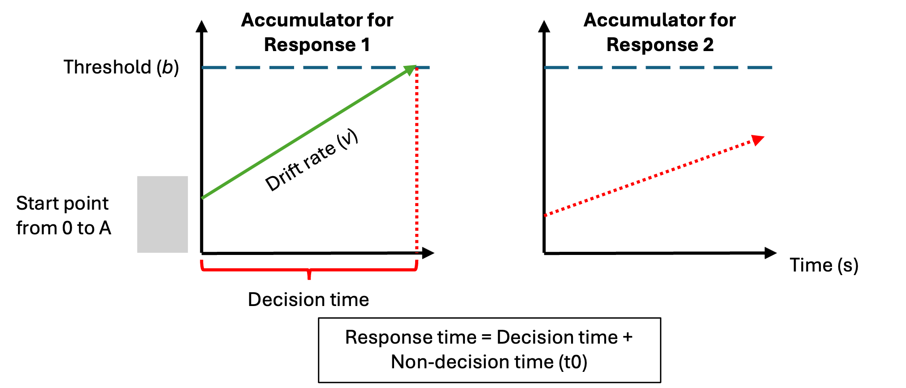
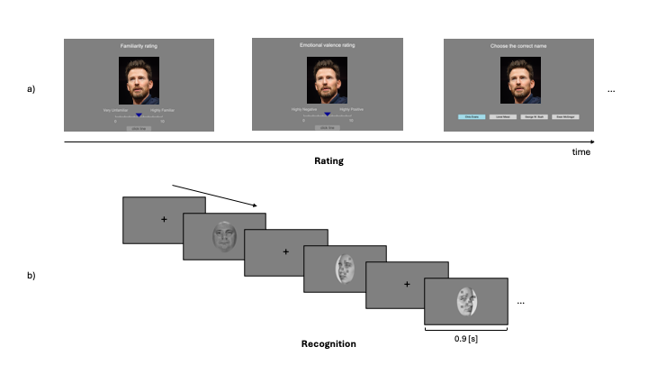

```{r}
#| label: setup
#| include: false

pkgs <- c(
  "tidyverse", "RColorBrewer", "patchwork", "paletteer", "here", "EMC2", 
  "tidybayes", "tinytable", "osfr"
)
vapply(
  pkgs, library, logical(1),
  character.only = TRUE, logical.return = TRUE
)

knitr::opts_chunk$set(echo = FALSE)

theme_set(
  theme_bw() +
    theme(text = element_text(size = 15, face = "bold"), 
          title = element_text(size = 15, face = "bold"),
          legend.position = "none")
)
## plot settings ##
## Plot colors
safe_pal <- paletteer_d("rcartocolor::Safe", 4)

myColors_3 <- c(
  "novel"   = safe_pal[1],
  "learned" = safe_pal[2],
  "famous"  = safe_pal[3]
)

# Subsets for single-experiment plots if still needed
myColors_1 <- myColors_3[c("novel", "learned")]
myColors_2 <- myColors_3[c("novel", "famous")]

## Set the amount of dodge in figures
pd <- position_dodge(0.7)
pd2 <- position_dodge(1)
```



# Introduction

The ability to quickly and accurately recognise a familiar face is an important aspect of everyday life, as it guides social behaviour.
The way that one might interact with a family member or friend is different to a stranger.
Moreover, for familiar individuals, we not only know what they look like, but we also have access to person knowledge, such as their traits, attitudes, name and professional status.
To date, most prior face recognition research has used manifest (observed) measures (i.e., response times and accuracy) to assess one's ability to recognise faces.
As such, less is known about the latent computational processes that support face recognition [@phillipsStateModellingFace2025].
In the current project, we investigated how different types of familiarity, including visual feature familiarity and stored person knowledge, affected the latent processes that can be estimated by evidence accumulation models (EAMs; @ratcliffModelingResponseTimes1998).
This computational approach has provided new insights on the dynamics of the decision process supporting face recognition.

The structure of mental processes that support face recognition has been a topic of investigation over the last 50 years [@johnstonFamiliarUnfamiliarFace2009; @natuNeuralProcessingFamiliar2011].
One influential cognitive model of face recognition proposed a division between structural encoding of facial features, and more elaborate processes associated with identity recognition and person information [@bruceUnderstandingFaceRecognition1986].
Subsequent neuroscience research in humans and monkeys has enriched this model by relating different cognitive processes to different brain circuits [@landiFastLinkFace2021 @gobbiniNeuralResponseVisual2006; @gobbiniNeuralSystemsRecognition2007; @haxbyDistributedHumanNeural2000; @duchaineRevisedNeuralFramework2015].
The resulting model is a distributed neural network that incorporates two distinct systems: a core system and an extended system.
The core system is dedicated to structural coding of facial features.
In contrast, the extended system is involved in more elaborate processes, such as those related to person knowledge [@duchaineRevisedNeuralFramework2015; @gobbiniNeuralSystemsRecognition2007; @haxbyDistributedHumanNeural2000; @ishaiLetsFaceIt2008; @kanwisher111FunctionalArchitecture2011].
By mediating the retrieval of identity-specific information from memory, the extended system is able to support the recognition of faces for which prior person knowledge information has been stored [@idagobbiniSocialEmotionalAttachment2004; @leibenluftMothersNeuralActivation2004].

Given the importance of knowing who it is you are interacting with, the study of familiarity has been a key aspect of the face perception research [@youngAreWeFace2018].
Largely using manifest measures, such as response time and accuracy, research consistently shows that familiar faces, especially those imbued with person knowledge, facilitate a range of face recognition processes compared to previously unseen individuals or visually familiar faces [@ramonFamiliarityMattersReview2018; @youngAreWeFace2018].
It has been argued that person knowledge involves a qualitatively different and deeper level of processing than visual familiarity [@schwartzIndependentContributionPerceptual2019], which facilitates the accurate discrimination of familiar from unfamiliar faces [@akanHaventSeenYou2023; @schwartzRolesPerceptualConceptual2016; @akanHaventSeenYou2023; @birdEffectsPreexperimentalKnowledge2011; @klatzkyRecognizingFamiliarUnfamiliar1984; @schwaningerRoleFeaturalConfigural2002].

Although manifest (observed) measures of performance have formed the bedrock of research findings on face perception, there have been many calls in recent years to embrace more computational approaches in social and cognitive neuroscience research [@charpentierApplicationComputationalModels2018; @cheongComputationalModelsSocial2017; @forstmannIntroductionModelBasedCognitive2024a; @hackelComputationalNeuroscienceApproaches2018; @lockwoodComputationalModellingSocial2021; @parker2024; @phillipsStateModellingFace2025].
One benefit of adopting computational approaches is that relationships between parts of a system can be more explicitly specified [@hintzmanWhyAreFormal1991; @yarkoniGeneralizabilityCrisis2022], which aids the development of theory [@muthukrishnaProblemTheory2019; @oberauerAddressingTheoryCrisis2019; @proulxStatisticalRitualTheory2021].
A second benefit is that latent (unobserved) parameters can be estimated, which can give rise to different interpretations of the cognitive processes involved in task performance [@ratcliffEffectsAgingReaction2001].
And at present, there is almost no understanding of the computational processes that support face recognition processes when familiarity is based on visual exposure compared to stored person knowledge [@phillipsStateModellingFace2025].

Evidence accumulation models (EAM) are one approach to investigate the computational processes that are involved in speeded decision tasks (for a review, see @ratcliffDiffusionDecisionModel2016).
While a variety of different evidence accumulation models exists, they all share a similar set of assumptions: that evidence for each response option accumulates at different rates until one response option crosses a threshold and a response is triggered (see @fig-LBA for an example of the linear ballistic accumulator (LBA) model; @brownSimplestCompleteModel2008).
These models work by translating the distribution of response times for correct and incorrect responses into estimates of latent variables assumed to underlie the decision-making process [@tbl-lba; @brownSimplestCompleteModel2008; @donkinDrawingConclusionsChoice2011].
These latent variables can then be mapped onto psychological constructs [@myersPracticalIntroductionUsing2022].
For example, drift rate is the rate at which evidence in favor of a decision accumulates over time, reflecting the signal-to-noise ratio provided by the stimulus.
Threshold represents the amount of accumulated evidence needed to trigger the decision, reflecting the response caution towards a specific response.
The starting point is the amount of evidence towards a response before the accumulation of evidence begins, reflecting the *a priori* bias towards a response.
Finally, the non-decision time is an estimation of the time taken to complete processes that are not involved in the decision time, such as stimulus encoding and motor responses.

:::: {.place arguments="bottom, scope: \"parent\", float: true"}
:::{#fig-LBA fig-cap = "Schematic of the linear ballistic accumulator (LBA) model"}
{width="90%"}
:::

*This diagram represents the accumulation process one trial of a perceptual decision task for the linear ballistic accumulator (LBA). Participants are required to chose between two options (Response 1 and Response 2). In a LBA model, there is a separated accumulation of evidence (v) for each response option. In this example, the correct response is Response 1. The accumulator on the left is the accumulator for the correct response (Response 1), and the green line in represents the rate at which the evidence accumulates in favor of that response option. The accumulator on the right is the accumulator for the incorrect response (Response 2), and the dash red line represents the rate at which the evidence accumulates in favor of this response option. Once the accumulated evidence crosses the threshold (b) of a response option, the corresponding response is chosen (in this case Response 1).* 
::::

```{r}
#| label: lba-params
#| include: false

# Helper function to handle format-dependent subscripts
format_subscript <- function(text) {
  if (knitr::is_html_output()) {
    # For HTML output, use HTML tags
    return(text)
  } else {
    # For Typst/PDF output, replace HTML tags with Typst's sub[] function
    text <- gsub("<sub>(.*?)</sub>", "#sub[\\1]", text)
    return(text)
  }
}

# create a df
lba_params <- tribble(
  ~Parameter, ~Label, ~Construct,
  "Start point", "A", "response bias",
  "Drift rate", "v", "signal-to-noise ratio",
  "Threshold", "b", "response caution",
  "Non-decision time", format_subscript("t<sub>0</sub>"), "stimulus encoding and motor response"
)
```

```{r}
#| label: tbl-lba
#| tbl-cap: Parameters in the linear ballistic accumulator model

lba_params |> 
  tt()
```

In the present study, we used evidence accumulation modelling to ask new questions regarding the computational processes that support the recognition of familiar versus unfamiliar individuals.
More specifically, we address how different types of familiarity (visual feature familiarity versus visual feature familiarity plus person knowledge) impact the threshold (response caution) and drift rate (signal-to-noise ratio) parameters.
Based on prior work in experimental psychology [@parker2024; @ratcliffDiffusionDecisionModel2016], we chose to primarily focus on threshold and drift rate as our primary parameters of interest because we could easily and intuitively see how performance advantages could emerge based on familiarity.
For instance, based on conventional use of EAMs [@myersPracticalIntroductionUsing2022], increases in signal-to-noise ratio and/or reductions in response caution could be interpreted as the task setting becoming easier.

We, therefore, hypothesised that either drift rate and/or threshold would be affected by the face familiarity manipulation.
However, given the general lack of prior evidence accumulation modelling in face recognition research, we were unsure *a priori* of the direction of the effects.
For instance, we considered it plausible that novel compared to familiar stimuli could provide a benefit in some instances, by virtue of a pop-out or novelty detector [@glanzerMirrorEffectRecognition1985; @kormi-nouriNoveltyEffectSupport2005; @schomakerNoveltyEnhancesVisual2012; @tulvingNoveltyAssessmentBrain1995].
Likewise, we also considered it plausible that familiar compared to novel stimuli could providing a benefit based on the many advantages reported for recognising personally familiar or famous individuals [@ramonFamiliarityMattersReview2018; @youngAreWeFace2018].
Nonetheless, across a series of experiments, we used manipulations of familiarity that either only targeted the operation of core system only or the core and extended system of face perception (@tbl-exp), so that we could further understand the computational processes that underpin different types of familiar face recognition.

```{r}
#| label: exp-details
#| include: false

# create a df
exp_details <- tribble(
  ~Exp, ~Setting, ~'Familiarity type', ~'Face comparision', ~'Face system',
  "1", "laboratory", "visual", "visual exposure vs unknown", "core",
  "2", "online", "visual", "visual exposure vs unknown", "core",
  "3", "laboratory", "visual & person knowledge", "famous vs unknown", "core & extended",
  "4", "online", "visual & person knowledge", "famous vs unknown", "core & extended",
  "5", "online", "visual & person knowledge", "famous vs unknown", "core & extended",
)
```

```{r}
#| label: tbl-exp
#| tbl-cap: An overview of the experimental work

exp_details |> 
  tt()
```

# Method and Materials

## Pre-registration and open science

We report how we determined our sample size, all data exclusions (if any), all manipulations, and all measures in the four experiments [@simonsConstraintsGeneralityCOG2017].
For each experiment, the research question, hypotheses, experimental design, planned analysis, and exclusion criteria were preregistered ((Experiment 1: <https://osf.io/azyvu/overview>); (Experiment 2: <https://osf.io/tu2eh/overview>); (Experiment 3: <https://osf.io/ut78f/overview>); (Experiment 4 <https://osf.io/vj2aq/overview>) and (Experiment 5 <https://osf.io/6tqxw/overview>).
The raw data and analysis code are available on GitHub (<https://github.com/cbs-lab/face-familiarity-eam>).

```{r}
#| label: exclusions-all
#| include: false

data_exp1 <- read_csv(here("exp_1", "data", "data_exp_1.csv"))
data_exp2 <- read_csv(here("exp_2", "data", "data_exp_2.csv"))
data_exp3 <- read_csv(here("exp_3", "data", "data_exp_3.csv"))
data_exp4 <- read_csv(here("exp_4", "data", "data_exp_4.csv"))
data_exp5 <- read_csv(here("exp_5", "data", "data_exp_5.csv"))

excl_exp1 <- read_csv(here("exp_1", "data", "exclusions_exp_1.csv"))
excl_exp2 <- read_csv(here("exp_2", "data", "exclusions_exp_2.csv"))
excl_exp3 <- read_csv(here("exp_3", "data", "exclusions_exp_3.csv"))
excl_exp4 <- read_csv(here("exp_4", "data", "exclusions_exp_4.csv"))
excl_exp5 <- read_csv(here("exp_5", "data", "exclusions_exp_5.csv"))


list_participant_analysis_1 <- data_exp1 |> distinct(pid) |> pull(pid)
list_participant_analysis_2 <- data_exp2 |> distinct(pid) |> pull(pid)
list_participant_analysis_3 <- data_exp3 |> distinct(pid) |> pull(pid)
list_participant_analysis_4 <- data_exp4 |> distinct(pid) |> pull(pid)
list_participant_analysis_5 <- data_exp5 |> distinct(pid) |> pull(pid)
```

```{r}
#| label: demographics-all
#| include: false

demo_exp1 <- read_csv(here("exp_1", "data", "demo_exp_1_clean.csv"))
demo_exp2 <- read_csv(here("exp_2", "data", "demo_exp_2_clean.csv"))
demo_exp3 <- read_csv(here("exp_3", "data", "demo_exp_3_clean.csv"))
demo_exp4 <- read_csv(here("exp_4", "data", "demo_exp_4_clean.csv"))
demo_exp5 <- read_csv(here("exp_5", "data", "demo_exp_5_clean.csv"))


# Exp 1 inline text scalar
rt_exp_1  <- read_csv(here("exp_1", "data", "raw_data_exp_1.csv"))
perc_rt_1 <- rt_exp_1 |>
  filter(pid != "1") |>
  summarise(perc = round(mean(rt > 2, na.rm = TRUE) * 100, 3)) |>
  pull(perc)
```

```{r}
#| label: participant-summary
#| include: false

participant_summary <- bind_rows(
  tibble(
    Experiment               = "Experiment 1",
    Setting                  = "Lab",
    Completed                = excl_exp1$completed,
    `RT exclusions`          = excl_exp1$exclude_rt,
    `Accuracy exclusions`    = excl_exp1$exclude_acc,
    `Familiarity exclusions` = "—",
    `Final n`                = excl_exp1$final_n,
    Female                   = sum(demo_exp1$gender == "Female"),
    Male                     = sum(demo_exp1$gender == "Male"),
    `Mean age (SD)`          = paste0(round(mean(demo_exp1$age), 1), " (",
                                      round(sd(demo_exp1$age), 1), ")")
  ),
  tibble(
    Experiment               = "Experiment 2",
    Setting                  = "Online",
    Completed                = excl_exp2$completed,
    `RT exclusions`          = excl_exp2$exclude_rt,
    `Accuracy exclusions`    = excl_exp2$exclude_acc,
    `Familiarity exclusions` = "—",
    `Final n`                = excl_exp2$final_n,
    Female                   = sum(demo_exp2$gender == "Female"),
    Male                     = sum(demo_exp2$gender == "Male"),
    `Mean age (SD)`          = paste0(round(mean(demo_exp2$age), 1), " (",
                                      round(sd(demo_exp2$age), 1), ")")
  ),
  tibble(
    Experiment               = "Experiment 3",
    Setting                  = "Lab",
    Completed                = excl_exp3$completed,
    `RT exclusions`          = excl_exp3$exclude_rt,
    `Accuracy exclusions`    = excl_exp3$exclude_acc,
    `Familiarity exclusions` = as.character(excl_exp3$exclude_ratings),
    `Final n`                = excl_exp3$final_n,
    Female                   = sum(demo_exp3$gender == "Female"),
    Male                     = sum(demo_exp3$gender == "Male"),
    `Mean age (SD)`          = paste0(round(mean(demo_exp3$age), 1), " (",
                                      round(sd(demo_exp3$age), 1), ")")
  ),
  tibble(
    Experiment               = "Experiment 4",
    Setting                  = "Online",
    Completed                = excl_exp4$completed,
    `RT exclusions`          = excl_exp4$exclude_rt,
    `Accuracy exclusions`    = excl_exp4$exclude_acc,
    `Familiarity exclusions` = as.character(excl_exp4$exclude_ratings),
    `Final n`                = excl_exp4$final_n,
    Female                   = sum(demo_exp4$gender == "Female"),
    Male                     = sum(demo_exp4$gender == "Male"),
    `Mean age (SD)`          = paste0(round(mean(demo_exp4$age), 1), " (",
                                      round(sd(demo_exp4$age), 1), ")")
  ),
  tibble(
    Experiment               = "Experiment 5",
    Setting                  = "Online",
    Completed                = excl_exp5$completed,
    `RT exclusions`          = excl_exp5$exclude_rt,
    `Accuracy exclusions`    = excl_exp5$exclude_acc,
    `Familiarity exclusions` = as.character(excl_exp4$exclude_ratings),
    `Final n`                = excl_exp5$final_n,
    Female                   = sum(demo_exp5$gender == "Female"),
    Male                     = sum(demo_exp5$gender == "Male"),
    `Mean age (SD)`          = paste0(round(mean(demo_exp5$age), 1), " (",
                                      round(sd(demo_exp5$age), 1), ")")
  )
)

# ── Extract scalars for inline text ──────────────────────────────────────────
exp1_row <- participant_summary |> filter(Experiment == "Experiment 1")
exp2_row <- participant_summary |> filter(Experiment == "Experiment 2")
exp3_row <- participant_summary |> filter(Experiment == "Experiment 3")
exp4_row <- participant_summary |> filter(Experiment == "Experiment 4")
exp5_row <- participant_summary |> filter(Experiment == "Experiment 5")


# Exp 1
completed_exp1      <- as.integer(exp1_row$Completed)
exclude_rt_exp1     <- as.integer(exp1_row$`RT exclusions`)
exclude_acc_exp1    <- as.integer(exp1_row$`Accuracy exclusions`)
final_n_exp1        <- as.integer(exp1_row$`Final n`)
male_exp1           <- as.integer(exp1_row$Male)
female_exp1         <- as.integer(exp1_row$Female)
mean_age_exp1       <- as.numeric(str_extract(exp1_row$`Mean age (SD)`, "^[0-9.]+"))
sd_age_exp1         <- as.numeric(str_extract(exp1_row$`Mean age (SD)`, "(?<=\\().*(?=\\))"))
min_age_exp1        <- min(demo_exp1$age)
max_age_exp1        <- max(demo_exp1$age)

# Exp 2
completed_exp2      <- as.integer(exp2_row$Completed)
exclude_rt_exp2     <- as.integer(exp2_row$`RT exclusions`)
exclude_acc_exp2    <- as.integer(exp2_row$`Accuracy exclusions`)
final_n_exp2        <- as.integer(exp2_row$`Final n`)
male_exp2           <- as.integer(exp2_row$Male)
female_exp2         <- as.integer(exp2_row$Female)
mean_age_exp2       <- as.numeric(str_extract(exp2_row$`Mean age (SD)`, "^[0-9.]+"))
sd_age_exp2         <- as.numeric(str_extract(exp2_row$`Mean age (SD)`, "(?<=\\().*(?=\\))"))
min_age_exp2        <- min(demo_exp2$age)
max_age_exp2        <- max(demo_exp2$age)

# Exp 3
completed_exp3       <- as.integer(exp3_row$Completed)
exclude_rt_exp3      <- as.integer(exp3_row$`RT exclusions`)
exclude_acc_exp3     <- as.integer(exp3_row$`Accuracy exclusions`)
exclude_ratings_exp3 <- as.integer(exp3_row$`Familiarity exclusions`)
over_95_exp3         <- as.integer(excl_exp3$over_95)
under_55_exp3        <- as.integer(excl_exp3$under_55)
final_n_exp3         <- as.integer(exp3_row$`Final n`)
male_exp3            <- as.integer(exp3_row$Male)
female_exp3          <- as.integer(exp3_row$Female)
mean_age_exp3        <- as.numeric(str_extract(exp3_row$`Mean age (SD)`, "^[0-9.]+"))
sd_age_exp3          <- as.numeric(str_extract(exp3_row$`Mean age (SD)`, "(?<=\\().*(?=\\))"))
min_age_exp3         <- min(demo_exp3$age)
max_age_exp3         <- max(demo_exp3$age)

# Exp 4
completed_exp4       <- as.integer(exp4_row$Completed)
exclude_rt_exp4      <- as.integer(exp4_row$`RT exclusions`)
exclude_acc_exp4     <- as.integer(exp4_row$`Accuracy exclusions`)
exclude_ratings_exp4 <- as.integer(exp4_row$`Familiarity exclusions`)
final_n_exp4         <- as.integer(exp4_row$`Final n`)
male_exp4            <- as.integer(exp4_row$Male)
female_exp4          <- as.integer(exp4_row$Female)
mean_age_exp4        <- as.numeric(str_extract(exp4_row$`Mean age (SD)`, "^[0-9.]+"))
sd_age_exp4          <- as.numeric(str_extract(exp4_row$`Mean age (SD)`, "(?<=\\().*(?=\\))"))
min_age_exp4         <- min(demo_exp4$age)
max_age_exp4         <- max(demo_exp4$age)

# Exp 5
completed_exp5       <- as.integer(exp5_row$Completed)
exclude_rt_exp5      <- as.integer(exp5_row$`RT exclusions`)
exclude_acc_exp5     <- as.integer(exp5_row$`Accuracy exclusions`)
exclude_ratings_exp5 <- as.integer(exp5_row$`Familiarity exclusions`)
over_95_exp5         <- as.integer(excl_exp5$over_95)
under_55_exp5        <- as.integer(excl_exp5$under_55)
final_n_exp5         <- as.integer(exp5_row$`Final n`)
male_exp5            <- as.integer(exp5_row$Male)
female_exp5          <- as.integer(exp5_row$Female)
mean_age_exp5        <- as.numeric(str_extract(exp5_row$`Mean age (SD)`, "^[0-9.]+"))
sd_age_exp5          <- as.numeric(str_extract(exp5_row$`Mean age (SD)`, "(?<=\\().*(?=\\))"))
min_age_exp5         <- min(demo_exp5$age)
max_age_exp5         <- max(demo_exp5$age)
```

## Experiment 1

### Participants

All participants were recruited using either an online recruiting platform (<https://marktplatz.uzhalumni.ch>) or via a mailing list dedicated to students from the Department of Psychology of the University of Zurich.
Sample size was determined in advance.
Following previous suggestions from @heathcoteDynamicModelsChoice2019, a parameter recovery study was run to estimate if 30 usable participant datasets were sufficient to accurately recover the parameter estimates.
The parameter recovery study included 30 participant datasets, each with 180 trials (90 trials "familiar" and 90 trials "unfamiliar") and with our selected model parameterisation.
The arameters were sufficiently well-recovered to suggest the combination of data and design were a reasonable choice (See Supplementary Materials).

`r completed_exp1` healthy participants completed Experiment 1 (@tbl-participants).
All participants reported normal or corrected-to-normal vision and received payment (20 CHF) for participating in the experiment.
Based on our preregistration, response times longer than 2.5 seconds were removed from the analysis.
However, this cutoff value led to the the removal of 59% of the trials of one participant.
Given the recommendation of having a certain number of trials per condition per participant when using evidence-accumulation models [@heathcoteDynamicModelsChoice2019; @parker2024], this participant was excluded from the data analysis.
In the end, the data of `r final_n_exp1` participants (`r male_exp1` men and `r female_exp1` women) was retained for the analysis and the LBA modeling.
Ages ranged from `r min_age_exp1` to `r max_age_exp1` years old ($M_{age} =$ `r mean_age_exp1`, $SD_{age} =$ `r sd_age_exp1`).
All experiments in this paper were approved by the ethics committee of the Federal Institute of Technology Zurich (ETHZ), and all participant gave their informed consent to participate in the study.

```{r}
#| label: tbl-participants
#| tbl-cap: "Participant summary across experiments."
#| include: true

participant_summary |>
  tt(notes = "RT = response time; — = criterion not applicable for this experiment.") |>
  style_tt(fontsize = 0.85)
```

### Stimuli

The stimuli consisted of images selected from two different data sets of face images: the Face Research Lab London Set (REF : DeBruine, Lisa; Jones, Benedict (2017): <https://doi.org/10.6084/m9.figshare.5047666.v5>) and the Color FERET Database (<https://www.nist.gov/itl/products-and-services/color-feret-database>).
Each of these data sets is composed of images of different identities taken from different angle points.
102 identities were selected from the Face Research Lab London Set and 51 from the Color FERET Database.
For each selected identity, three pictures of the face at three different view points (3/4 left view, frontal view and 3/4 right view) were cropped to only keep the internal features of the face.
All of the images processing was realized using the free community-developed software GNU Image Manipulation Program (@GIMP).
After 4 pilots experiments, we removed 27 identities (21 from the Face Research Lab London Set and 6 from the Color FERET Database) due to to the presence of identifiable features (i.e. skin marks, make-up...).
In total, the data set of face images used in Experiment 1 contained 756 images: one set of three colorful face images and one set of three gray scaled face images for each of the 126 identities.

### Material

Stimuli were presented on the screen of a MacBook Pro (Apple M2 Pro, macOS 13 Ventura).
The experiment was run on Psychopy Coder (version: 2022.5, @peircePsychoPy2ExperimentsBehavior2019) and the code used for the experimental procedure is available on OSF (<https://osf.io/azyvu/overview>).

### Procedure

The experimental task was divided into two distinct parts: a familiarization part and a recognition part (@fig-proc-exp1).
In the familiarization part, the face of 30 unknown identities were presented on the screen and participants were told to memorize the identity of the faces.
One familiarization trial consisted of the presentation of 6 face images, one after the other, depicting the same identity but varying in viewing points (3/4 left view, frontal view and 3/4 right view) and the colorimetry (colorful image, gray scale image).
The variability of the face presentation (viewing points and colorimetry) was used to avoid that participants memorized the "picture" of the face instead of the "identity" of the face.
The duration of each image presentation was 0.75 second.
Each participant underwent 30 familiarization trials.
During the familiarization, we introduced catch trials to ensure participants attention.
After some familiarization trials, a gray-scale image of a person's face was presented on the screen.
Participants were asked to press the "q" key if the face belonged to the last seen identity or the "p" key if it was not.
The faces seen during the familiarization were considered the "Learned" faces within-subject condition.

In the recognition part, participants completed three blocks of 90 recognition trials.
Each block was separated from another by a short break.
Half of the trials were learned identities trials and the other half were new, previously unseen identities trials.
In each trial, a gray-scale image of a face was shown on the screen.
Participants were asked to choose if they had previously seen this face in the familiarization part or not.
If they recognised the face, they should press the "q" key and if they did not recognise the face, then they should press the "p" key.
Participants were asked to respond as quickly and accurately as possible.
It is important to note that participants never saw two pictures of the same learned identity in the same block and never saw the same picture (3/4 left view, frontal view, or 3/4 right view) of a learned identity during the entire recognition part.
Furthermore, each novel identity was only presented once in the entire recognition part.
Response time \[s\] and accuracy were collected after each recognition trial.

:::: {.place arguments="bottom, scope: \"parent\", float: true"}
:::{#fig-proc-exp1 fig-cap = "Experimental procedure of Experiment 1"}

:::

*The experimental procedure was divided into two parts: a familiarization part and a recognition part. a) In the familiarization part, participants were asked to memorize the face identity of 30 identities. For each identity, participants looked at 6 pictures depicting the same identity with different face orientation (3/4 left view, frontal view and 3/4 right view) and different colorimetry (color and gray scale images) in the order presented here: 3/4 left view, frontal view and 3/4 right view in color, followed by 3/4 right view, frontal view and 3/4 left view in gray scale. b) In each trial of the recognition part, participants had to decided if they recognize the face shown on the screen from the familiarization part. If they did, they had to press the "q" key and if the did not, the "p" key. They completed three blocks of 60 trials (half of them were from the familiarization part, half were novel faces). For the recognition part, only gray scale images of faces were used (for both learned faces and novel faces).* 
::::

## Experiment 2

### Participants

All participant were recruited on the Prolific platform (<https://www.prolific.com>).
Participants had to be located in the United Kingdom or in the United States, be aged between 18-65 years old, with normal or corrected-to-normal vision and speak fluent English.
Furthermore, Prolific offers the option to chose the approval rate of the participants willing to take part in the study.
The approval rate is the percentage for which participants has been approved in previous experiment.
An approval rating between 95% and 100% was chosen in our study to try to ensure high data quality.
`r completed_exp2` participants completed Experiment 2.
Following our preregistered exclusion criterion, `r exclude_rt_exp2` participants were excluded because their percentage of missed trials was higher than 25% and `r exclude_acc_exp2` was removed because the overall accuracy was lower than 55%.
In the end, data from `r final_n_exp2` participants (`r male_exp2` men and `r female_exp2` women) were retained for the analysis and the LBA modeling.
Ages ranged from `r min_age_exp2` to `r max_age_exp2` ($M_{age} =$ `r mean_age_exp2`, $SD_{age} =$ `r sd_age_exp2`).
Following Prolific payment principles, each participant received 9£ for the completion of the study.

### Stimuli

In an attempt to replicate the findings of Experiment 1, the stimuli used in this experiment were exactly the same as the ones used in Experiment 1 (See Method and Materials, Experiment 1, Stimuli).

### Material

Given the online nature of this experiment, participants were asked to complete the study using a desktop computer.
The experimental procedure has been tested on three different operative systems (PC, Macintosh and Linux), as well as on three different web browsers (Google Chrome, Safari and Firefox).
Participants were asked to specifically used these operating systems and web browsers to ensure a consistent procedure and participant experience.

### Procedure

On Prolific, participants who wished to take part in the experiment read the study information and selected an URL link to the Pavlovia (Open Science Tools, Nottingham, UK) platform.
After selecting the URL link, a Pavlovia webpage opened to the inform consent of the study.
Participants chose if they wanted to complete this study or not after reading the inform consent.
The access to the task was only granted if participants accepted the terms of the inform consent.

Regarding the experimental procedure, it was almost identical to the one used in Experiment 1 (Method and Materials, Experiment 1, Procedure).
A response time window was added in the recognition part of the experiment.
Instead of removing trials with a response time higher than 2.5 seconds after data collection, we decided to implement a response time window of 2 seconds for each recognition trial.
In Experiment 1, `r perc_rt_1`% of the trials were longer than 2 seconds.
We expected participants to quickly get accustomed to the response time limit and that the average percentage of missed trials will be similar or lower than in Experiment 1.
Response time \[s\] and accuracy were collected after each recognition trial.

## Experiment 3

### Participants

All participant were recruited using either an online recruiting platform (<https://marktplatz.uzhalumni.ch>) or via a mailing list dedicated to students from the Department of Psychology of the University of Zurich.
`r completed_exp3` healthy participants completed Experiment 3.
We deviated from our preregistration in one way.
Since this experiment was conducted to investigate how highly familiar faces affect the computational processes of face recognition, we had to remove `r exclude_ratings_exp3` more participants who did not show a level of familiarity high enough with the presented faces in the first part of the experiment.
This scenario did not occur during the pilot experiments we conducted and thus was not part of our preregistration.

Based on our preregistered criteria, a further participant was excluded from further data analysisdue to an overall recognition accuracy larger than 95%.
In the end, the data of `r final_n_exp3` participants (`r male_exp3` men and `r female_exp3` women) were retained for further analysis and LBA modeling.
Ages ranged from `r min_age_exp3` to `r max_age_exp3` years old ($M_{age} =$ `r mean_age_exp3`, $SD_{age} =$ `r sd_age_exp3`).
All participants reported normal or corrected-to-normal vision and received payment (25 CHF) for participating in the experiment.

### Stimuli

Two types of pictures were used for this experiment to create our within-subject stimuli conditions.
Images used for the "Novel" condition were the same pictures used in Experiment 1: the data set of face images contained 378 images since only the set of three gray scaled face images for each of the 126 identities was used for this experiment.
Pictures depicting celebrities ("Famous" condition) were taken from the internet.
For each of the 60 preselected celebrities, 3 pictures depicting them from a similar angle to the "Novel" faces were chosen (3/4 left view, frontal view and 3/4 right vie).
Moreover, 60 more pictures (one for each of the celebrities) was only used for the first part of the experiment.
All of the "Famous" images processing was realized using the GNU Image Manipulation Program (@GIMP).
Background was removed from the picture and replace by the same background used in the "Novel" images.
The same gray scale filter used for the "Novel" faces was applied to the celebrities images used during the recognition part.
In total, the data set of face images used in this experiment contained 618 images: 1 set of three gray scaled face images for each of the 126 novel identities, 1 set of three gray scaled face images for each of the 60 famous identities and 60 images of celebrities used in the first part of the experiment.
Furthermore, a gray mask was added on top of each pictures ("Novel" faces and "Learned" faces) during the recognition part.
Each mask was composed of 10 grey rectangles which position differs in function of the face orientation (See @fig-mask-exp3 for an example of the mask in question).
The addition of a grey mask on top the face images decreased the overall accuracy of the recognition part during pilot work to a percentage of correct answer suited for the application of evidence-accumulation modeling.
Without this addition, the overall accuracy would be too extreme.

:::: {.place arguments="bottom, scope: \"parent\", float: true"}
:::{#fig-mask-exp3 fig-cap = "Non-masked and masked images"}

:::

*a) Images showing faces used in Experiment 1 and 2 for the three different face orientation (3/4 left, frontal view, 3/4 right) b) Same faces with the gray mask added on top of the images. These images were used in the recognition part of Experiment 3. Each mask is composed of 10 gray rectangles which position was adapted in function of the face orientation.These faces were used in the "novel" condition of Experiment 3.* 
::::

### Material

Stimuli were presented on the screen of a MacBook Pro (Apple M2 Pro, macOS 14 Sonoma).
The experiment was run on Psychopy Coder (version: 2022.5, @peircePsychoPy2ExperimentsBehavior2019) and the code used for the experimental procedure is available on OSF (<https://osf.io/ut78f/overview>).

### Procedure

The experimental task was divided into two distinct parts: a rating part and a recognition part (@fig-proc-exp3).
During the rating part, participants were presented pictures of 60 celebrities.
They were asked to rate these celebrities on two different features: how familiar the celebrity was to them (from 0: Highly unfamiliar to 10: Highly familiar) and how positive or negative were their feelings towards the celebrity (from 0:Highly negative to 10: Highly positive).
After the two rating scales, participants were asked to choose the correct name of the same identity from four different naming options.
From the 60 celebrities faces presented during the rating part, the 30 celebrities with the highest familiarity (with a minimum of 7 out of 10) and whose names were correctly assigned were for the "Famous" faces condition of the recognition part.
Thus, the set of "Famous" faces used in the recognition part was individualized for each participant.
In the recognition part, participants completed three blocks of 90 recognition trials.
Each block was separated from another by a short break.
Half of the trials were famous identities trials and the other half were new, previously unseen identities trials.
At each trial, a gray scale image of a face was shown on the screen.
Participants were asked to choose if they recognize the face (and not the picture) seen this face in the familiarization part or not.
If they did, the should press the "q" key and if they did not, the "p" key.
Based on pilot work, task difficulty was increased by adding a response time window of 0.9 second during each recognition trial.
Response time \[s\] and accuracy were collected after each trial.

:::: {.place arguments="bottom, scope: \"parent\", float: true"}
:::{#fig-proc-exp3 fig-cap = "Experimental procedure of Experiment 3"}

:::

*The experimental procedure was divided into two parts: a rating part and a recognition part. a) In the rating part, participants were asked to rate famous faces on two distinct features using rating scales (0-10): their familiarity (low to high) and the emotional valence (negative to positive). After the two rating scales, they had to chose the correct name of the celebrities from four different naming options.(Disclaimer: the picture used here was not used in the actual rating part of the experiment. Its purpose here is to demonstrate what participants had to realize in the first part of the experiment. Image attribution: Philip Romano, CC BY-SA 4.0 <https://creativecommons.org/licenses/by-sa/4.0>, via Wikimedia Commons, <https://commons.wikimedia.org/wiki/File:ChrisEvans2023.jpg>) b) In each trial of the recognition part, participants had to decided if they recognize the face shown on the screen. If they did, they had to press the "q" key and if the did not, the "p" key. They completed three blocks of 60 trials (half of them were famous faces, half were novel faces).* 
::::

### Issues with response times collection

During data analysis, we observed that the distribution of the response times for Experiment 3 looked did not look positively skewed (right skewed).
After investigation of the code used to run the experiment, we noticed that there was a coding error, which resulted in this abnormal response times distribution.
We decided to not run further data analysis (LBA model) for this experiment because evidence-accumulation models expect the response times distribution to be right skewed.
Instead, we decided to replicate Experiment 4, in which the same face familiarity levels (novel vs famous) were manipulated.

## Experiment 4 and Experiment 5

### Participants

All participant were recruited on the Prolific platform (<https://www.prolific.com>) using the same criteria as Experiment 2.

For Experiment 4, `r completed_exp4` participants completed the experiment.
Following our preregistered exclusion criterion, `r exclude_ratings_exp4` did not show a sufficiently high level of familiarity with the famous faces.
In addition, `r exclude_rt_exp4` participant was excluded because the percentage of missed trials was higher than 25% and `r exclude_acc_exp4` were removed because the overall accuracy was lower than 55% or higher than 95%.
In the end, the data of `r final_n_exp4` participants (`r male_exp4` men and `r female_exp4` women) were retained for further analysis and LBA modeling.
Ages ranged from `r min_age_exp4` to `r max_age_exp4` ($M_{age} =$ `r mean_age_exp4`, $SD_{age} =$ `r sd_age_exp4`).
Following Prolific payment principles, each participant received 9£ for the completion of the study.

`r completed_exp5` participants completed Experiment 5.
`r exclude_ratings_exp5` did not show a sufficiently high level of familiarity with the famous faces and `r exclude_acc_exp5` were removed because the overall accuracy was lower than 55% or higher than 95%.
In the end, the data of `r final_n_exp5` participants (`r male_exp5` men and `r female_exp5` women) were retained for further analysis and LBA modeling.
Ages ranged from `r min_age_exp5` to `r max_age_exp5` ($M_{age} =$ `r mean_age_exp5`, $SD_{age} =$ `r sd_age_exp5`).
Following Prolific payment principles, each participant received 9£ for the completion of the study.

### Stimuli

Initially, we planned to use the exact same stimuli as the one used in Experiment 3.
However, during the pilot, it was noticed that the "Famous" faces and the "Novel" faces contained differences in low visual features such as brightness, luminosity angle and the resolution of the picture.
These differences might have aided the categorization between "famous" and "novel" stimuli and affected the estimation of our parameters of interest.
To avoid that decisions are based on visual features and not on familiarity, we changed the face pictures data set for both conditions in Experiment 4 and Experiment 5.

For the "Famous" condition, faces were all taken from <https:://commons.wikimedia.org>.
For each of the famous identities (30 men, 30 women), four pictures were selected: one for the rating part of the experiment and three were used in the recognition part.
The list of the attributions as well as the URL links to all the pictures can be found on OSF (Experiment 4: <https://osf.io/vj2aq/overview> and Experiment 5: <https://osf.io/6tqxw/overview>).
For the "Novel" condition, face images were taken from the "10K US Adult Faces Database" [@bainbridgeIntrinsicMemorabilityFace2013].
These pictures depict faces in a natural environment, similar to the selected images of the celebrities.
103 faces were selected from this database and used in the recognition part of the experiment.

To avoid recognition based on low visual features, we decided to not standardize the brightness and luminosity angle of the entire picture dataset for both novel and famous faces.
The original viewing point, luminosity angle, brightness and background of the picture were not manipulated.
The rationale behind this decision was to avoid adding modifications to the original image that might facilitate the categorization between the stimuli conditions.
The only low level visual feature that we standardized across all the images was the resolution.
After cropping, every images was down sampled to a 250 pixels (px) height, a height similar to the original height of the images from "10K US Adult Faces Database", and grayscaled.

### Material

As Experiment 2, since this was an online data collection protocol, participants were asked to complete the study using a desktop computer.

### Procedure

The online procedure was the same as the one described for Experiment 2: on Prolific, participants who wished to take part in the experiment read the study information and selected an URL link to the Pavlovia platform.
After selecting the URL link, a Pavlovia webpage opened to the inform consent of the study.
Participants chose if they wanted to complete this study or not after reading the inform consent.
The access to the task was only granted if participants accepted the terms of the inform consent.

The experimental procedure was similar to the one used for Experiment 3 (see Method and Materials, Experiment 3, Procedure): participants first underwent a rating part which preceded the recognition part.
The only modification added to the recognition part was the increase of the response time window from 0.9s to 1.1s.

## Evidence accumulation modeling

### Model specification

A hierarchical LBA model was fit to the data with model specifications outlined in our preregistrations (@tbl-model-formula).
LBA models have one accumulator for each response option, with potentially different parameter values.
In our design, that meant that for Experiment 1 and 2, there was one accumulator for the "Learned" response and another for the "Novel" response.
For Experiment 4 and 5, there was one accumulator for the "Famous" response and another for the "Novel" response.
More specifically, for Experiment 1 and 2, threshold was allowed to vary by participants' response (Learned/Novel) whereas mean drift rate was allowed to vary by the stimulus condition (Learned/Novel) and the match between the accumulator and the stimulus (TRUE/FALSE).
If the stimulus was "Learned", then the accumulator for the "Learned" response would be TRUE, whereas the accumulator for the "Novel" response would be FALSE.
The difference between the TRUE and FALSE accumulator represents the quality of the information processing about a decision [@lewandowskyComputationalModelingCognition2018].
A greater difference between these accumulators means a greater quality of evidence accumulating towards that decision.

For every model, threshold was allowed to vary by response (Novel/Learned for Experiment 1 and 2, Novel/Famous for Experiment 4 and 5).
The standard deviation for the true accumulator was allowed to vary by the match factor whereas the the standard deviation for the false accumulator was kept uniform to make the model identifiable [@donkinGettingMoreAccuracy2009].
A single value for the start point (A) and non-decision time (t0) was estimated for our preregistered models but model estimations where these parameters were allowed to vary are described in supplementary materials.

```{r}
#| label: data-model-formula
#| include: false

# create a df
lba_formula <- tribble(
  ~Parameter, ~Label, ~Condition, ~Response, ~Accuracy, ~Fixed,
  "Start point", "A", "-", "-", "-", "1",
  "Mean drift rate", "v", "yes", "no", "yes", "-",
  "SD drift rate", "sd_v", "no", "no", "yes", "-",
  "SD false drift rate", "false.sd_v", "-", "-", "-", "1",
  "Threshold", "b", "yes", "yes", "no", "-",
  "Non-decision time", "t0", "yes", "no", "no", "-",
  "SD Non-decision time", "st_0", "-", "-", "-", "0",
)
```

```{r}
#| label: tbl-model-formula
#| tbl-cap: "Formula specification for the pre-registered linear ballistic accumulator model."
#| include: true

lba_formula |>
   tt(notes = "Condition = training condition (Learned vs. Novel or Famous vs. Novel); Response = key-press response (same vs. different); Accuracy = (true/correct vs false/incorrect); SD = standard deviation.")
```

### Model estimation

We carried out a Bayesian model estimation using the EMC2 R package.
Details about the priors of each model are provided in supplementary materials and the code required to run the analyses is available on OSF.
Priors were chosen to be weakly-informative meaning that they have little influence on the estimation.
The parameter were estimated through two sampling steps.
First, a separate estimation of the fixed effects for each participants was conducted.
These estimations were used as the starting point for the full hierarchical model.

Priors here.
Model checking here.
Refer to plots in Supps.

### Data analysis

For every experiment, the separate analysis of response times and accuracy was conducted using Bayesian Multilevel Models with R Package brms [@brms].
The evidence-accumulation modelling analyses of the distributions of response times for the correct and wrong answers were realized using the EMC2 R package [@EMC2].
In order to make inference about the magnitude of familiarity effects, differences in parameter estimates across conditions were compared.
Our inferences are based on the median and 95% quantile interval of the posterior distributions and the difference contrasts between the conditions of interest.

# Results

First, we show raw data plots and descriptive statistics when reaction time and accuracy are analyses separately.
Second, results from the LBA modeling will be presented.

## Raw data plots and descriptive statistics

```{r}
#| label: summarise-rt-acc
#| include: false

# ── Load & normalise ─────────────────────────────────────────────────────────
# Each experiment gets labelled and pid coerced to character on read-in
read_exp <- function(path, exp_number, recode = NULL) {
  read_csv(here(path)) |>
    mutate(
      pid        = as.integer(factor(pid)),  # consistent across both formats
      experiment = as.integer(exp_number),
      block      = as.integer(block),
      cond       = str_to_lower(cond)
    ) |>
    (\(df) if (!is.null(recode)) mutate(df, cond = dplyr::recode(cond, !!!recode)) else df)() |>
    select(pid, block, experiment, cond, acc, rt)
}

data_all <- bind_rows(
  read_exp("exp_1/data/data_exp_1.csv", 1),
  read_exp("exp_2/data/data_exp_2.csv", 2),
  read_exp("exp_3/data/data_exp_3.csv", 3),
  read_exp("exp_4/data/data_exp_4.csv", 4, recode = c(familiar = "famous", novel = "novel")),
  read_exp("exp_5/data/data_exp_5.csv", 5)
)

head(data_all)

# ── Summary helpers ───────────────────────────────────────────────────────────
# Participant-level summary, then group-level summary joined back on
summarise_pid <- function(df, outcome_col, summary_fn) {
  summary_fn <- rlang::as_function(summary_fn)  # handles both mean and ~ mean(.x)*100
  
  pid_level <- df |>
    drop_na(all_of(outcome_col)) |>
    group_by(experiment, pid, cond) |>
    summarise(pid_val = summary_fn(.data[[outcome_col]]), .groups = "drop")

  grp_level <- pid_level |>
    group_by(experiment, cond) |>
    summarise(
      grp_val = mean(pid_val),
      sem     = sd(pid_val) / sqrt(n()),
      .groups = "drop"
    )

  left_join(pid_level, grp_level, by = c("experiment", "cond"))
}

acc_all <- summarise_pid(data_all, "acc", ~ mean(.x) * 100)
head(acc_all)

rt_all  <- summarise_pid(data_all, "rt",  mean)
head(rt_all)

# Define which conditions belong to which experiments
exp_conds <- tribble(
  ~experiment, ~cond,
  1, "learned", 1, "novel",
  2, "learned", 2, "novel",
  3, "famous",  3, "novel",
  4, "famous",  4, "novel",
  5, "famous",  5, "novel",
)

# Filter rt_all and acc_all to only relevant conditions per experiment
rt_plot_data  <- rt_all  |> semi_join(exp_conds, by = c("experiment", "cond"))
acc_plot_data <- acc_all |> semi_join(exp_conds, by = c("experiment", "cond"))
```

```{r}
#| label: create-rt-acc-plots
#| include: false

## paired plots for summarised RT and accuracy data
paired_plot <- function(df, yvar, ylab, ylims) {
  
  # set consistent jitter for dots and lines
  pos <- position_jitter(width = 0.06, height = 0, seed = 123)
  
  ggplot(df, aes(x = cond, y = {{ yvar }}, 
                 fill = cond, colour = cond)) +
    # per-participant lines
    geom_line(
      aes(group = pid),
      position = pos,
      colour    = "grey70",
      linewidth = 0.3,
      alpha     = 0.5
    ) +
    # per-participant dots
    geom_point(
      position = pos,
      alpha    = 0.5,
      size     = 1.5
    ) +
    # group mean + 95% CI
    stat_summary(
      fun.data  = mean_se,
      geom      = "pointrange",
      colour    = "black",
      size      = 0.6,
      linewidth = 1.2,
      fun.args  = list(mult = 1.96)
    ) +
    # line connecting group means
    stat_summary(
      aes(group = experiment),
      fun       = mean,
      geom      = "line",
      colour    = "black",
      linewidth = 0.8
    ) +
    scale_fill_manual(values   = myColors_3) +
    scale_colour_manual(values = myColors_3) +
    facet_grid(
      ~ experiment, scales = "free_x",
      labeller = labeller(experiment = ~ paste("Experiment", .x))
    ) +
    coord_cartesian(ylim = ylims) +
    labs(x = NULL, y = ylab) 
}

acc_paired <- paired_plot(acc_plot_data, pid_val, "Accuracy [%]",  c(0, 100))
#acc_paired

rt_paired  <- paired_plot(rt_plot_data,  pid_val, "Mean RT [s]",   c(0, 1.75))
#rt_paired

## Density plots for all trial RT data

# Dummy data to set x limits per experiment
dummy_limits <- tibble(
  experiment = c(1, 1, 2, 2, 3, 3, 4, 4),
  rt         = c(0, 2.5, 0, 2.5, 0, 1.1, 0, 1.1),
  cond       = "novel",
  density    = 0
)

rt_density <- data_all |>
  drop_na(rt) |>
  semi_join(exp_conds, by = c("experiment", "cond")) |>
  ggplot(aes(x = rt, fill = cond, colour = cond)) +
  geom_density(alpha = 0.7) +
  # invisible points to set x range per facet
  geom_blank(
    data = dummy_limits,
    aes(x = rt),
    inherit.aes = FALSE
  ) +
  geom_text(
    data = tibble(
      experiment = 3, x = 0.08, y = 7,
      label = "RT artefact\n (80ms bins)"
    ),
    aes(x = x, y = y, label = label),
    inherit.aes = FALSE, size = 2.5, hjust = 0,
    colour = "grey40", lineheight = 0.9
  ) +
  geom_segment(
    data = tibble(experiment = 3, x = 0.48, xend = 0.58, y = 6.7, yend = 5.5),
    aes(x = x, xend = xend, y = y, yend = yend),
    inherit.aes = FALSE, colour = "grey40", linewidth = 0.4,
    arrow = arrow(length = unit(0.15, "cm"))
  ) +
  scale_fill_manual(values = myColors_3) +
  scale_colour_manual(values = myColors_3) +
  scale_x_continuous(breaks = seq(0, 2.5, by = 0.5)) +
  facet_grid(
    ~experiment,
    scales   = "free_x",
    labeller = labeller(experiment = ~ paste("Experiment", .x))
  ) +
  labs(
    x = "Response time [s]", y = "Density",
    fill = "Condition", colour = "Condition"
  ) +
  theme(
    legend.position  = c(0.92, 0.8),
    legend.text      = element_text(size = 7),
    legend.title     = element_text(size = 8)
  )
rt_density
```

```{r}
#| label: fig-acc-rt
#| fig-cap: "Proportion of correct responses [%] and mean response times [s] across conditions for the four experiments. Coloured points represent individual participant averages, black points denote the group mean and error bars represent 95% confidence intervals."
#| fig-subcap: 
#|  - "Proportion of correct responses [%]"
#|  - "Mean response times [s]"
#| layout-ncol: 1
#| warning: false
#| fig-width: 7
#| fig-height: 4

acc_paired
rt_paired
```

```{r}
#| label: fig-rt-density
#| fig-cap: "Density of response times [s] across conditions for the four experiments. The density plot for Experiment 3 clearly shows the timing quantisation artefact discussed in the Methods, where keypress responses were recorded in ~80ms bins rather than continuously."
#| warning: false
#| fig-width: 7
#| fig-height: 4

rt_density
```

## Evidence accumulation modeling results

For all experiments, posterior distributions for drift rate and threshold parameters are visualised in @fig-threshold-all and @fig-drift-all and the medians and 95% quantile intervals are summarised in @tbl-lba-params.

```{r}
#| label: download-models
#| include: false

## Model objects are rather big files, so we keep them on the OSF
## This will only download them once and not again
# OSF authentication is only required if the project is private.
# Once the project is made public, this line can be removed.
# To authenticate: store your OSF token in .Renviron as OSF_PAT=your_token
# See https://docs.ropensci.org/osfr/articles/auth.html for instructions.
# this next line means authentication is attempted only if a token exists — so the same code works for both private and public scenarios

if (Sys.getenv("OSF_PAT") != "") osf_auth(Sys.getenv("OSF_PAT")) 

## download function
download_if_missing <- function(exp_folder, file_name, local_dir) {
  if (!dir.exists(here(local_dir))) {
    dir.create(here(local_dir), recursive = TRUE)
  }
  local_file <- here(local_dir, file_name)
  if (!file.exists(local_file)) {
    osf_retrieve_node("65bt2") |>
      osf_ls_files() |>
      filter(name == exp_folder) |>
      osf_ls_files() |>
      osf_ls_files() |>
      filter(name == file_name) |>
      osf_download(path = here(local_dir), conflicts = "overwrite")
  }
}

download_if_missing("exp_1", "LBA_exp1.rds", "exp_1/models")
download_if_missing("exp_2", "LBA_exp2.rds", "exp_2/models")
download_if_missing("exp_4", "LBA_exp4.rds", "exp_4/models")
download_if_missing("exp_5", "LBA_exp5.rds", "exp_5/models")
```

```{r}
#| label: wrangle-lba
#| include: false

wrangle_lba <- function(model, exp_num, cond_label) {
  
  param_cols <- c(
    "v_SNovel_lMTRUE",
    "v_SNovel_lMFALSE",
    paste0("v_S", cond_label, "_lMTRUE"),
    paste0("v_S", cond_label, "_lMFALSE"),
    "sv_lMTRUE",
    "B_lRNovel",
    paste0("B_lR", cond_label),
    "A", "t0"
  )
  
  # subject-level — alpha, natural scale, drop constant
  params <- EMC2::parameters(model, selection = "alpha", 
                              N = NULL, map = TRUE) |>
    select(-any_of("sv_lMFALSE"))
  
  n_pids  <- length(unique(params$subjects))
  n_draws <- nrow(params) / n_pids
  
  # pid-level posteriors
  pid_long <- params |>
    as_tibble() |>
    pivot_longer(
      cols      = all_of(param_cols),
      names_to  = "param",
      values_to = "value"
    ) |>
    rename(pid = subjects) |>
    mutate(
      .draw      = rep(1:n_draws, each = length(param_cols), times = n_pids),
      experiment = exp_num
    )
  
  # group-level — mu, natural scale
  params_mu  <- EMC2::parameters(model, selection = "mu",
                                  N = NULL, map = TRUE)
  n_draws_mu <- nrow(params_mu)
  
  params_mu |>
    as_tibble() |>
    mutate(
      .draw      = 1:n_draws_mu,
      experiment = exp_num
    ) |>
    pivot_longer(
      cols      = all_of(param_cols),
      names_to  = "param",
      values_to = "value"
    )
}


# wrangle_lba <- function(model, exp_num, cond_label) {
#   # cond_label: "Learned" for Exp 1&2, "Famous" for Exp 4
#   
#   # Extract posterior samples and pivot to long format
#   params <- EMC2::parameters(model, selection = "alpha", N = NULL)
#   
#   param_cols <- c(
#     paste0("v_SNovel:lMTRUE"),
#     paste0("v_SNovel:lMFALSE"),
#     paste0("v_S", cond_label, ":lMTRUE"),
#     paste0("v_S", cond_label, ":lMFALSE"),
#     "sv_lMTRUE",
#     "B_lRNovel",
#     paste0("B_lR", cond_label),
#     "A", "t0"
#   )
#   
#   n_pids      <- length(unique(params$subjects))
#   n_draws     <- nrow(params) / n_pids
#   
#   pid_long <- params |>
#     as_tibble() |>
#     pivot_longer(
#       cols      = all_of(param_cols),
#       names_to  = "param",
#       values_to = "value"
#     ) |>
#     rename(pid = subjects) |>
#     mutate(
#       .draw  = rep(1:n_draws, each = length(param_cols), times = n_pids),
#       experiment = exp_num
#     )
#   
#   # Average across participants to get group level
#   pid_long |>
#     group_by(experiment, .draw, param) |>
#     summarise(value = mean(value, na.rm = TRUE), .groups = "drop")
# }
# 
# Load models and wrangle
LBA_exp1 <- readRDS(here("exp_1", "models", "LBA_exp1.rds"))
LBA_exp2 <- readRDS(here("exp_2", "models", "LBA_exp2.rds"))
LBA_exp4 <- readRDS(here("exp_4", "models", "LBA_exp4.rds"))
LBA_exp5 <- readRDS(here("exp_5", "models", "LBA_exp5.rds"))

theta_all <- bind_rows(
  wrangle_lba(LBA_exp1, 1, "Learned"),
  wrangle_lba(LBA_exp2, 2, "Learned"),
  wrangle_lba(LBA_exp4, 4, "Famous"),
  wrangle_lba(LBA_exp5, 5, "Famous")
)
```

```{r}
#| label: wrangle-threshold
#| include: false

# Threshold
thresh_all <- theta_all |>
  filter(str_detect(param, "B_")) |>
  mutate(
    response   = case_when(
      str_detect(param, "lRNovel")   ~ "novel",
      str_detect(param, "lRLearned") ~ "learned",
      str_detect(param, "lRFamous")  ~ "famous"
    ),
    response = factor(response, levels = c("novel", "learned", "famous")) |> droplevels()
    #experiment = factor(experiment, labels = c("Experiment 1", "Experiment 2", "Experiment 4"))
  )

# Threshold contrast
thresh_diff_all <- thresh_all |>
  pivot_wider(
    id_cols     = c(experiment, .draw),
    names_from  = response,
    values_from = value
  ) |>
  mutate(diff = novel - coalesce(learned, famous))  # works for both label schemes

# Quantiles for inline text
# Group-level quantiles per parameter per experiment — for inline text
theta_all_q <- theta_all |>
  group_by(experiment, param) |>
  median_qi(value)

# Threshold contrast quantiles per experiment
thresh_diff_q <- thresh_diff_all |>
  group_by(experiment) |>
  median_qi(diff)
```

```{r}
#| label: wrangle-drift
#| include: false

# Drift rate
drift_all <- theta_all |>
  filter(str_detect(param, "v_S")) |>
  mutate(
    condition = case_when(
      str_detect(param, "Novel")   ~ "novel",
      str_detect(param, "Learned") ~ "learned",
      str_detect(param, "Famous")  ~ "famous"
    ),
    accuracy  = if_else(str_detect(param, "TRUE"), "true", "false"),
    condition = factor(condition, levels = c("novel", "learned", "famous")) |> droplevels(),
    accuracy  = factor(accuracy,  levels = c("false", "true"))
  )

# TRUE - FALSE per condition
drift_acc_diff_all <- drift_all |>
  pivot_wider(
    id_cols     = c(experiment, .draw, condition),
    names_from  = accuracy,
    values_from = value
  ) |>
  mutate(
    diff       = true - false
    #experiment = factor(experiment, labels = c("Experiment 1", "Experiment 2", "Experiment 4"))
  )

# Novel - Learned/Famous contrast
drift_cond_diff_all <- drift_acc_diff_all |>
  pivot_wider(
    id_cols     = c(experiment, .draw),
    names_from  = condition,
    values_from = diff
  ) |>
  mutate(diff = novel - coalesce(learned, famous))

# Quantiles for inline text
drift_acc_diff_q <- drift_acc_diff_all |>
  group_by(experiment, condition) |>
  median_qi(diff)

drift_cond_diff_q <- drift_cond_diff_all |>
  group_by(experiment) |>
  median_qi(diff)
```

### Experiment 1

*Threshold:* We estimated the threshold parameter for both response options (Novel and Learned).
Inspection of the posterior distributions of the effect of face familiarity on the threshold parameter shows that while the threshold for Novel faces is greater that the one for Learned faces.

```{r}
#| label: fig-threshold-all
#| fig-cap: "Threshold estimates across experiments"
#| fig-subcap:
#|   - "Threshold by response"
#|   - "Threshold contrast"
#| layout-ncol: 2
#| fig-height: 10
#| fig-width: 7

# Left panel: condition distributions
ggplot(thresh_all, aes(x = value, y = fct_rev(response), fill = response)) +
  stat_halfeye(alpha = 0.7) +
  geom_vline(xintercept = 0, colour = "darkgrey") +
  scale_fill_manual(values = myColors_3) +
  scale_y_discrete(drop = TRUE) +
  facet_grid(experiment ~ .,
             labeller = labeller(experiment = ~ paste("Experiment", .x)),
             scales = "free_y") +
  labs(x = "Threshold", y = "Response") +
  theme(
    text       = element_text(size = 20, face = "bold"),
    strip.text = element_text(size = 20, face = "bold"),
    axis.text  = element_text(size = 20, face = "bold")
  )

# Right panel: contrast
ggplot(thresh_diff_all, aes(x = diff, y = "")) +
  stat_halfeye(alpha = 0.7, fill = "#1A7A7A") +
  geom_vline(xintercept = 0, colour = "darkgrey") +
  facet_grid(experiment ~ .,
             labeller = labeller(experiment = ~ paste("Experiment", .x))) +
  labs(x = "Threshold difference", y = "") +
  theme(
    text       = element_text(size = 20, face = "bold"),
    strip.text = element_text(size = 20, face = "bold"),
    axis.text  = element_text(size = 20, face = "bold")
  )
```

*Drift rate:* To quantify the contribution of face familiarity on the drift rate, we computed the difference between the TRUE and FALSE drift rate for each familiarity condition as our main dependent measure.
To estimate the familiarity effect, we then subtracted the drift rate difference on learned trials from novel trials.
Inspection of the posterior distribution shows that there is a novelty effect in drift rate difference in Experiment 1.
The quality of the evidence accumulation was greater for Novel faces compared to Learned faces.

```{r}
#| label: fig-drift-all
#| fig-cap: "Drift rate estimates across experiments"
#| fig-subcap:
#|   - "Drift rate (TRUE - FALSE) by condition"
#|   - "Drift rate contrast"
#| layout-ncol: 2
#| fig-height: 10
#| fig-width: 7

# Left panel: condition distributions
ggplot(drift_acc_diff_all, aes(x = diff, y = fct_rev(condition), fill = condition)) +
  stat_halfeye(alpha = 0.7) +
  geom_vline(xintercept = 0, colour = "darkgrey") +
  scale_fill_manual(values = myColors_3) +
  scale_y_discrete(drop = TRUE) +
  facet_grid(experiment ~ .,
             labeller = labeller(experiment = ~ paste("Experiment", .x)),
             scales = "free_y") +
  labs(x = "Drift rate (TRUE - FALSE)", y = "Condition") +
  theme(
    text       = element_text(size = 20, face = "bold"),
    strip.text = element_text(size = 20, face = "bold"),
    axis.text  = element_text(size = 20, face = "bold")
  )

# Right panel: contrast
ggplot(drift_cond_diff_all, aes(x = diff, y = "")) +
  stat_halfeye(alpha = 0.7, fill = "#1A7A7A") +
  geom_vline(xintercept = 0, colour = "darkgrey") +
  facet_grid(experiment ~ .,
             labeller = labeller(experiment = ~ paste("Experiment", .x))) +
  labs(x = "Drift rate difference", y = "") +
  theme(
    text       = element_text(size = 20, face = "bold"),
    strip.text = element_text(size = 20, face = "bold"),
    axis.text  = element_text(size = 20, face = "bold")
  )
```

```{r}
#| label: tbl-lba-params
#| tbl-cap: "Posterior median and 95% quantile intervals for threshold and drift rate parameters across experiments."
#| include: true

# Build table
thresh_cond_table <- theta_all_q |>
  filter(str_detect(param, "B_")) |>
  mutate(
    parameter = "Threshold",
    condition = case_when(
      str_detect(param, "lRNovel")   ~ "novel",
      str_detect(param, "lRLearned") ~ "learned",
      str_detect(param, "lRFamous")  ~ "famous"
    )
  ) |>
  select(experiment, parameter, condition, median = value, lower = .lower, upper = .upper)

thresh_table <- thresh_diff_all |>
  group_by(experiment) |>
  median_qi(diff) |>
  mutate(
    parameter = "Threshold contrast",
    condition = if_else(experiment == 4 | experiment == 5, "novel - famous", "novel - learned")
  ) |>
  select(experiment, parameter, condition, median = diff, lower = .lower, upper = .upper)

drift_table <- drift_acc_diff_all |>
  group_by(experiment, condition) |>
  median_qi(diff) |>
  mutate(parameter = "Drift rate") |>
  select(experiment, parameter, condition, median = diff, lower = .lower, upper = .upper)

drift_diff_table <- drift_cond_diff_all |>
  group_by(experiment) |>
  median_qi(diff) |>
  mutate(
    parameter = "Drift rate contrast",
    condition = if_else(experiment == 4 | experiment == 5, "novel - famous", "novel - learned")
  ) |>
  select(experiment, parameter, condition, median = diff, lower = .lower, upper = .upper)

## Combine
lba_table <- bind_rows(
  thresh_cond_table,
  thresh_table,
  drift_table,
  drift_diff_table
) |>
  mutate(
    qi         = paste0("[", round(lower, 3), ", ", round(upper, 3), "]"),
    median     = round(median, 3),
    experiment = paste("Experiment", experiment),
    Parameter  = factor(parameter, levels = c("Threshold", "Threshold contrast",
                                               "Drift rate", "Drift rate contrast")),
    Condition  = factor(condition, levels = c("novel", "learned", "famous",
                                              "novel - learned", "novel - famous"))
  ) |>
  arrange(experiment, Parameter, Condition) |>
  select(
    Experiment = experiment,
    Parameter,
    Condition,
    Median     = median,
    `95% QI`   = qi
  )
# 
# # lba_table |>
# #   tt()
# 
# 
# find first row of each experiment group
exp1_start <- which(lba_table$Experiment == "Experiment 1")[1]
exp2_start <- which(lba_table$Experiment == "Experiment 2")[1]
exp4_start <- which(lba_table$Experiment == "Experiment 4")[1]
exp5_start <- which(lba_table$Experiment == "Experiment 5")[1]

lba_table |>
  select(-Experiment) |>
  tt(
    notes = "QI = quantile interval."
  ) |>
  format_tt(j = "Median", digits = 2, num_fmt = "decimal") |>
  group_tt(
    i = list(
      "Experiment 1" = exp1_start,
      "Experiment 2" = exp2_start,
      "Experiment 4" = exp4_start,
      "Experiment 5" = exp5_start

    )
  ) |>
  style_tt(fontsize = 0.85)

# Reshape to wide format — one row per parameter/condition, columns per experiment
# lba_wide <- bind_rows(
#   thresh_cond_table,
#   thresh_table,
#   drift_table,
#   drift_diff_table
# ) |>
#   mutate(
#     qi     = paste0("[", round(lower, 3), ", ", round(upper, 3), "]"),
#     median = round(median, 3),
#     Parameter = factor(parameter, levels = c(
#       "Threshold", "Threshold contrast",
#       "Drift rate", "Drift rate contrast"
#     )),
#     Condition = factor(condition, levels = c(
#       "novel", "learned", "famous",
#       "novel - learned", "novel - famous"
#     ))
#   ) |>
#   arrange(experiment, Parameter, Condition) |>
#   select(Parameter, Condition, experiment, median, qi) |>
#   pivot_wider(
#     names_from  = experiment,
#     values_from = c(median, qi),
#     names_glue  = "{.value}_{experiment}"
#   ) |>
#   select(
#     Parameter, Condition,
#     `Median` = median_1, `95% QI` = qi_1,
#     `Median ` = median_2, `95% QI ` = qi_2,
#     `Median  ` = median_4, `95% QI  ` = qi_4
#   )
# 
# lba_wide |>
#   tt(
#     notes = "QI = quantile interval."
#   ) |>
#   format_tt(replace = list("NA" = "—")) |>
#   format_tt(j = c("Median", "Median ", "Median  "), digits = 2, num_fmt = "decimal") |>
#   group_tt(
#     j = list(
#       "Experiment 1" = 3:4,
#       "Experiment 2" = 5:6,
#       "Experiment 4" = 7:8
#     )
#   ) |>
#   style_tt(fontsize = 0.85)
```

### Experiment 2

*Threshold:* Inspection of the posterior distribution shows that there is an effect of familiarity on the threshold parameter.

*Drift rate:* Inspection of the posterior distribution shows that there is a similar familiarity effect in drift rate difference as in Experiment 1.
The quality of the evidence accumulation was greater for Novel faces compared to Learned faces.

### Experiment 3

As explained in the Methods, due to a timing artefact in data collection (responses recorded in discrete 80ms bins), the RT distributions from Experiment 3 do not meet the continuity assumptions of the LBA and we do not report model parameter estimates for this experiment.

### Experiment 4

*Threshold:* Inspection of the posterior distribution shows that there is an effect of familiarity on the threshold parameter.
Threshold was greater for Novel faces than for Famous faces.

*Drift rate:* Inspection of the posterior distribution shows that there is a familiarity effect in drift rate difference, which mirrors the results from Experiment 1 and Experiment 2.
The quality of the evidence accumulation was greater for Novel faces compared to Famous faces.

### Experiment 5

*Threshold:* Inspection of the posterior distribution shows that there is an effect of familiarity on the threshold parameter which mirrors the results from Experiment 4.

*Drift rate:* Inspection of the posterior distribution shows that there is a familiarity effect in drift rate difference, which mirrors the results from Experiment 1, Experiment 2 and Experiment 4.
The quality of the evidence accumulation was greater for Novel faces compared to Famous faces.

# General discussion

We set out to understand not merely *that* familiarity affects face recognition, but *how* — specifically, which latent computational processes are modulated when a face is familiar versus novel.
By fitting linear ballistic accumulator models to recognition data across a series of experiments, we show that familiarity primarily affects the quality of evidence accumulation, with a secondary and smaller effect on response caution.
This computational signature — a novelty advantage in drift rate, accompanied by a modest novelty advantage in threshold — replicates across visual familiarity (Experiments 1 and 2), and visual familiarity and person knowledge (Experiment 4 and 5).
These findings move beyond manifest measures of accuracy and response time to characterise the decision-level mechanisms that underpin familiar face recognition [@phillipsStateModellingFace2025].

## The impact of visual familiarity

The most theoretically important finding is the combination of drift rate and threshold effects.
Across Experiments 1 and 2, the novelty advantage in drift rate was substantially larger than the novelty advantage in threshold.
This dissociation matters because the two parameters reflect qualitatively different aspects of the decision process.
Drift rate indexes the quality of evidence accumulation — how cleanly and rapidly perceptual and cognitive systems extract decision-relevant information from a face.
Threshold indexes how much accumulated evidence is required before a decision is triggered.
The dominance of the drift rate effect localises familiarity's influence to the quality of signal from the image more so than as a function of response bias between novel and familiar key presses.

Set within the Bruce and Young framework of face perception [@bruceUnderstandingFaceRecognition1986], visual familiarity modulates the quality of structural encoding and feature matching within the core face processing system [@bruceUnderstandingFaceRecognition1986; @gobbiniNeuralResponseVisual2006], thus generating a stronger perceptual signal that feeds into the decision process.
One interpretation of the pattern of results obtained here could be that novel faces, by this account, provide a cleaner and less ambiguous perceptual signal than visually familiar faces — consistent with "pop-out" and attentional capture accounts [@johnstonAttentionCaptureNovel1990; @lev-ariEcologicalViewSelective2022; @lubowVisualSearchFunction1997].
In contrast, visually familiar faces may generate noisier representations due to interference from accumulated but imperfectly consolidated memory traces [@rapcsakFaceRecognition2019].

The smaller but reliable threshold effect reflects a qualitatively different influence on performance.
In a yes/no recognition task, participants must set separate response criteria for the "familiar" and "novel" responses, and the higher threshold for the novel response is consistent with a well-documented conservative rejection bias in recognition memory [@glanzerMirrorEffectRecognition1985; @stretchDifferenceStrengthbasedFrequencybased1998]: participants are more willing to endorse familiarity than to endorse novelty, requiring more evidence before committing to a rejection.
Because the drift rate advantage is substantially larger, the net behavioural outcome remains a novel face advantage in speed and accuracy — the signal quality benefit outweighs the response caution cost.

## The impact of person knowledge

Extending these findings to person knowledge is theoretically important because famous faces engage not only the core face processing system but also the extended system, which mediates retrieval of identity-specific person knowledge [@gobbiniNeuralSystemsRecognition2007; @duchaineRevisedNeuralFramework2015].
Experiment 4 and 5 showed a pattern broadly consistent with Experiments 1 and 2: novel faces produced higher drift rates and slightly higher response caution than famous faces.
This raises the possibility that the computational signature of novelty generalises beyond visual familiarity to person knowledge contexts.
Moreover, the effects were larger for drift rate and threshold compared to Experiments 1 and 2, which might suggest that the more stable memory traces for famous people based on the added person knowledge could exaggerate the novelty or "pop-out" effect.

At this stage, however, we remain cautious in our conclusion here and suggest that person knowledge effects on drift rate and threshold remain a largely open empirical question, which requires careful further investigation using improved and/or different stimuli, such as personally familiar people (e.g., family, friends or partners).
More generally, our findings underscore that although the study of true familiarity - where person knowledge is available - is more akin to our real-world experiences of interacting with familiar people, it is inherently more difficult to study with tight experimental control [@burtonFacePerception2024].

## Limitations

A novelty advantage in drift rate is in conceptual agreement with studies that reported a better perception ability for novel faces than for visually familiar faces [@bindemannPerceivedAbilityActual2014; @readChangingPhotosFaces1990], whist being in apparent tension with prior work reporting better recognition performance for famous or personally familiar faces [@hancockRecognitionUnfamiliarFaces2000; @jenkins2011; @klatzkyRecognizingFamiliarUnfamiliar1984].
We suggest two factors may contribute to this discrepancy.
First, prior studies used manifest measures that conflate signal quality with response bias, which makes interpretation more difficult [@wagenmakersEZdiffusionModelResponse2007].
Second, novel faces may benefit from a processing advantage specific to the task structure (old/new detection task): a correct novel response requires only the absence of a recognition signal, whereas a correct famous response requires the presence of one.
However, using this design also has benefits as it allows comparison to numerous previous works that did use an old/new recognition task with faces or other stimuli to study visual recognition.
Whether the novelty advantage in drift rate reflects a genuine signal quality effect, a task asymmetry, or both, remains an open question that future work should address by comparing LBA parameters across paradigms that vary the demands placed on novel versus familiar face processing.

Previous evidence accumulation model development studies have emphasised how the number of trials per cell of the design can influence model fitting and parameter estimation [@alexandrowiczComparingEightParameter2020; @lercheHowManyTrials2017; @wagenmakersEZdiffusionModelResponse2007].
Our design (90 trials per condition) and control of error rates followed the minimum recommendations to apply EAM [@lukenParameterIdentifiabilityEvidenceaccumulation2025], as well as a parameter recovery study that showed 90 trials per condition was sufficient to recover simulated parameters.
Practical considerations were also incorporated, including the challenge of finding face stimuli with standardized low-level visual features that includes a large number of identities.
Nonetheless, adding more trials per condition (e.g., 200 per condition; @boagExpertGuidePlanning2025) would have increased the robustness of our parameter estimates.

## Future directions

We can think of several relevant future directions in addition to the ones already mentioned.
First, a learning curve design that tracks LBA parameters across repeated exposure sessions would address at which stage of familiarity drift rate changes occur, and would provide a more dynamic account of how computational processes change as familiarity is acquired [@ramonFamiliarityMattersReview2018].
Second, to more directly link together computational processes and neural architectures, future research might use a joint-modelling approach [@palestroTutorialJointModels2018; @voDeepLatentVariable2024].
Joint-modelling integrates different sources of data (e.g. behavioural and neuroimaging data) to estimate the relationship between responses in particular brain regions, such as core and extended face networks, and latent computational parameters.
Third, individual differences in face recognition ability represent a natural and important extension.
Super-recognisers and individuals with developmental prosopagnosia differ dramatically in recognition performance [@dobelProsopagnosiaApparentCause2007; @duchaineCambridgeFaceMemory2006; @russellSuperrecognizersPeopleExtraordinary2009], and drift rate — as the primary carrier of familiarity effects here — may be the parameter that most cleanly differentiates these groups.
Fourth, testing the domain-specificity of these effects would be valuable to determine whether the effects of visual familiarity apply to other categories of visual stimuli, such as objects or scenes.



# Disclosures

## Data and code availability

All materials are available on GitHub (link) and the OSF (link).

## Author contributions

[CRediT](https://www.elsevier.com/researcher/author/policies-and-guidelines/credit-author-statement) author statement:

Conceptualization: RF, PD, RR\
Methodology: RF, RR\
Software: RF, RR\
Validation: RF, RR\
Formal analysis: RF, RR\
Investigation: RF\
Data Curation: RF, RR\
Writing - Original Draft: RF\
Writing - Review & Editing: RF, PD, RR\
Visualisation: RF, RR\
Supervision: RR\
Project Administration: RF, RR

## Competing interests

The authors declare no competing interests.



# References

::: {#refs}
:::
